# Facial-Expression-Recognition-Kaggle-Competition

### კონკურსის მიმოხილვა
* Facial-Expression-Recognition-Kaggle-Competition კონკურსის მიზანია ფოტოსურათზე გამოსახული სახის გამომეტყველების (ემოციის) ამოცნობა. ამისათვის გადმოგვეცემა ფოტოეურათების სიმრავლე. თითოეული სურათი 48x48 ზომისაა და დატასეტში წარმოდგენელია როგორც 48*48 რიცხვის (0-255) მიმდევრობა, ანუ სურათები შავ-თეთრია. ჩვენი მიზანია ავაგოთ ისეთი მოდელი, რომელიც თითოეულ ფოტოსურათს მიანიჭებს კატეგორიას (0=Angry, 1=Disgust, 2=Fear, 3=Happy, 4=Sad, 5=Surprise, 6=Neutral) სურათზე გამოსახული სახის გამომეტყველების (ემოციის) მიხედვით.

* ჩვენი მოდელი ფასდება **Accuracy** მეტრიკით, რაც გულისხმობს, მოდელი რამდენად სწორად ანიჭებს მოცემული 7 კატეგორიიდან ერთ-ერთს თითოეულ სურათს. Training პროცესში პირდაპირ **Accuracy** არ გამოგვადგება *Loss* ფუნქციად. გვჭირდება წარმოებადი *Loss* ფუნქცია, რადგან Deep Learning-ის ერთ-ერთი მთავარი კომპონენტი სწორედ Backpropagation-ით პარამეტრების Update-ია. ამ ამოცანაში *Loss* ფუნქციად ავირჩიე CrossEntropyLoss, რომელიც მოდელს სწორი კლასის ალბათობის მაქსიმიზაციისკენ უბიძგებს, რაც გამოიწვევს **Accuracy**-ს გაზრდას.  

---
### მიდგომა

* დავიწყე შედარებით მარტივი DataProcessing-ისა და მოდელების აგებით, რათა დაახლოებით გამეგო ამოცანის სირთულე. თავიდან შედარებით პატარა ნეირონული ქსელები ავაგე და თანდათან ვუმატებდი მოდელებს layer-ებს და ვუზრდიდი სიღრმესა და ნეირონების რაოდენობას თითო layer-ში.


---
### რეპოზიტორიის სტრუქტურა

```
Facial-Expression-Recognition-Kaggle-Competition/
│
├── facial-expression-recognition-01.ipynb     ← preprocessing, ექსპერიმენტები TwoLayerFC-ზე
├── facial-expression-recognition-02.ipynb     ← preprocessing, ექსპერიმენტები MultiLayerFC-ზე
├── facial-expression-recognition-03.ipynb     ← preprocessing, ექსპერიმენტები SimpleCNN-ზე
├── facial-expression-recognition-04.ipynb     ← preprocessing, ექსპერიმენტები DeepCNN-ზე
├── README.md
```

---

# Two Layer MLP

ეს არის ყველაზე მარტივი არქიტექტურა, რომლითაც გადავწყვიტე ამოცანის დაწყება. დასაწყისში ასეთი მარტივი მოდელის არჩევას რამდენიმე დადებითი მხარე შეიძლება ჰქონდეს:
* მარტივი მოდელია და ადვილია debugging/exploration.
* training-ის პროცესი სწრაფია.
* baseline შედეგს ვიგებთ.

მოდელის კლასი ასე გამოიყურება:
```python
class TwoLayerFC(nn.Module):
  def __init__(self, input_size, hidden_size, output_size, config=None):
    ...

  def forward(self, x):
    ...
```

ანუ არქიტექტურა ასეთია: 
* `Flatten` -> `FC Layer` -> `[Normalization Layer]` -> `Activation Layer` -> `[Dropout]` -> `FC Layer`, სადაც კვადრატულ ფრჩხილებში ჩასმული layer-ები `config`-ის მიხედვით შეიძლება გვქონდეს ან შეიძლება არ გვქონდეს.


## Sanity Check

რამდენიმე ეტაპიანი *Sanity Check* ჩავატარე იმისათვის, რომ დავრწმუნებულიყავი `TwoLayerFC` მოდელის იმპლემენტაციის სისწორეში. *Sanity Check*-ის დროს განსხვავებული მიდგომები მოვცადე და  თითოეული მიდგომა გამოვყავი ცალკე ნაწილად. ამ პროცესში ბევრი საინტერესო სირთულე გამოჩნდა ნეირონული ქსელის ტრენინგში და მინდოდა მესაუბრა თითოეულზე.


### Loss On Untrained Model

* ტრენინგის დაწყებამდე კარგია შევამოწმოთ რამდენად სწორად მუშაობს *Forward Pass*. ამისათვის ერთ-ერთი გზაა დაუტრენინგებელ ახალ შექმნილ მოდელში შევუშვათ დატა და ვნახოთ *Loss* რა მნიშვნელობას მიიღებს. თუ ყველაფერი სწორადაა (წონები შემთხვევითად დავაინიციალიზეთ, *Forward* სწორად არის დაიმპლემენტეული და ა.შ), როგორც წესი Loss საკმაოდ ახლოს იქნება ერთ რიცხვთან. ამ რიცხვის გაგება მარტივად შეგვიძლია. თუ გვაქვს `N` კლასი (ჩვენ შემთხვევაში `N = 7`) და მოდელი დაუტრენინგებელია, ანუ preferred კლასი არ აქვს არცერთი სურათისთვის, მაშინ შეგვიძლია დავუშვათ, რომ მისი `N` კომპონენტიანი output-ის [`p1`, ..., `pN`] ალბათობები დაახლოებით ერთმანეთის ტოლი უნდა იყოს: `pi ~ 1/N`, ყოველი `1 <= i <= N`-სთვის. შესაბამისად, საშუალო Loss ამ დატაზე უნდა გამოვიდეს `-log(pi)`, სადაც `pi` სწორი კლასის ალბათობაა, ხოლო `-log(pi) ~ -log(1/N) = log(N)`. რადგან ჩვენ შემთხვევაში `N = 7` => `log(N) = log(7) ~ 1.94`. 
* წინ დაშვებიდან გამომდინარე მოდელის საშუალო Loss ამ რიცხვთან ახლოს უნდა იყოს (არ არის აუცილებელი ზუსტად ტოლი იყოს, ალბათობები მეტწილად Random იქნება, მაგრამ არა Uniformly Random). შევამოწმოთ რამდენად სრულდება ეს პირობა:

```python
    # Create model
    model = TwoLayerFC(48*48, 64, 7).to(device)

    # Create criterion
    criterion = nn.CrossEntropyLoss()

    # Evaluate model
    loss, _ = evaluate(train_loader, model, criterion)

    # Print Loss
    print('Loss: %.4f' % loss)
```
ეს პროცესი შეგვიძლია გავიმეოროთ ბევრჯერ და მივიღებთ ასეთ შედეგს:

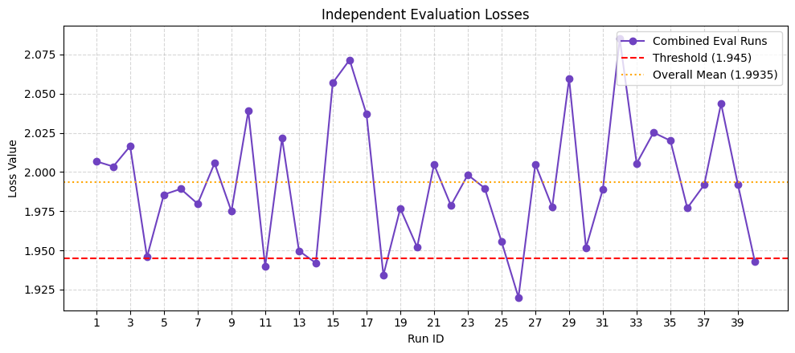

ვხედავთ, რომ საშუალოდ Loss-ები საკმაოდ ახლოს არის `1.94` ანუ ეს ნაწილი სწორად გვაქვს.


### Overfit On Small Data
* გარდა ზედა *sanity check*-ისა, ტრენინგამდე კარგია შევამოწმოთ, რამდენად შეუძლია მოდელს (თუნდაც ისეთ მარტივ მოდელს, როგორიც TwoLayerFC-ია) overfit პატარა დატაზე. 

* ამისათვის გამოვყავი 32 ცალი სურათი train დატადან:
```python
    X_tiny, y_tiny = X_train[:32], y_train[:32]
```
* ამის შემდეგ დავაინიციალიზე `model`, `optimizer`, `criterion`. `optimizer`-ზე შედარებით მარტივი არჩევანი გავაკეთე და `SGD` ავირჩიე:
```python
    # Create model, criterion, optimizer
    model     = TwoLayerFC(48*48, 64, 7).to(device)
    criterion = nn.CrossEntropyLoss()
    optimizer = SGD(model.parameters(), lr=1e-1)

    # Train model
    _ = train(tiny_loader, tiny_loader, model, criterion, optimizer, epochs=15)
```
* 15 ეპოქაში შესაძლებელი უნდა ყოფილიყო `accuracy=100%`-ის მიღწევა. `lr`-ის ცვლილების (ვცადე [1e-4, 1e-3, 1e-2, 5e-2, 1e-1]) შემდეგ საუკეთესო აღმოჩნდა `lr=1e-1` და მივირე შემდეგი შედეგი:

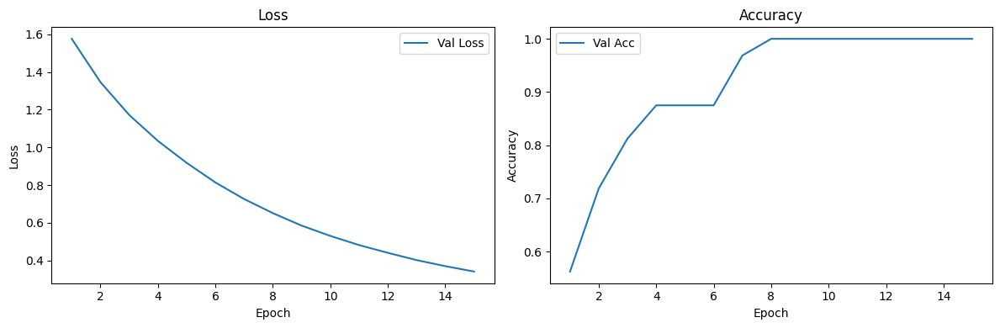

* ანუ მოდელს შეუძლია პატარა დატის სწავლა და რამდენიმე ეპოქაში აღწევს `accuracy=100%`-ს. ეპოქების რაოდენობას როცა ვზრდიდი `loss` 0-ს თანდათან უახლოვდებოდა. მაგალითად, `epoch=200`-ზე ასეთი შედეგი მივიღე:

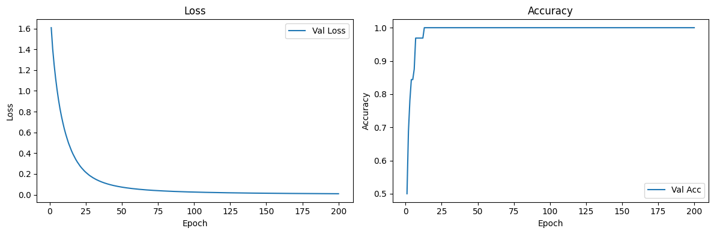

* აქედან შეგვიძლია კიდევ უფრო დავრწუმუნდეთ, რომ ჩვენი მოდელის იმპლემენტაცია სწორია და ყველაფერი უნდა მუშაობდეს წესით. 


### Loss vs. Accuracy

* ასევე, საინტერესო მიმართება გამოჩნდა Loss და Accuracy-ს შორის. დავაფიქსირე `sample_size = 64` ზომის validation set:
```python
    X_fixed      = X_train.sample(sample_size)
    y_fixed      = y_train[X_fixed.index]
    fixed_loader = DataLoader(ImageDataset(X_fixed, y_fixed, transform), batch_size=sample_size,shuffle=False)
```
* ყველა ეპოქისთვის sample_size ზომის ახალ X_sample, y_sample დატასეტს ვირჩევდი X_train, y_train და მოდელს ვატრენინგებდი. პარალელურად ვაკვირდებოდი `train_loss`, `train_acc`, `val_loss`, `val_acc`. ერთ-ერთი შედეგი ასე გამოიყურება:  

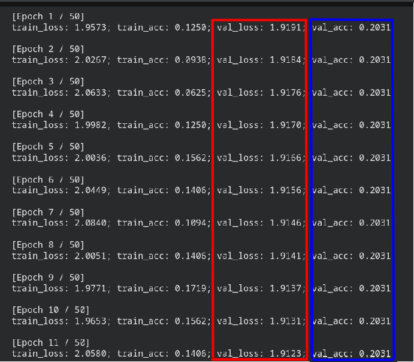

აქ საინტერესო ის არის, რომ `val_loss` სტაბილურად მცირდება, მაგრამ `val_acc` საერთოდ არ იცვლება. ამის მიზეზი ის არის, რომ *Loss* და *Accuracy* სხვადასხვა მეტრიკებია. *Loss* უწყვეტია, ხოლო *Accuracy* დისკრეტული. შესაბამისად, *Loss* შეიძლება მცირდებოდეს და სწორი კლასის ალბათობა იზრდებოდეს, თუმცა არასწორი კლასის ალბათობა იმდენად დიდი იყოს, რომ სწორი კლასის ალბათობის გაზრდა *Accuracy*-ის **argmax**-ს საერთოდ არ ცვლიდეს.    

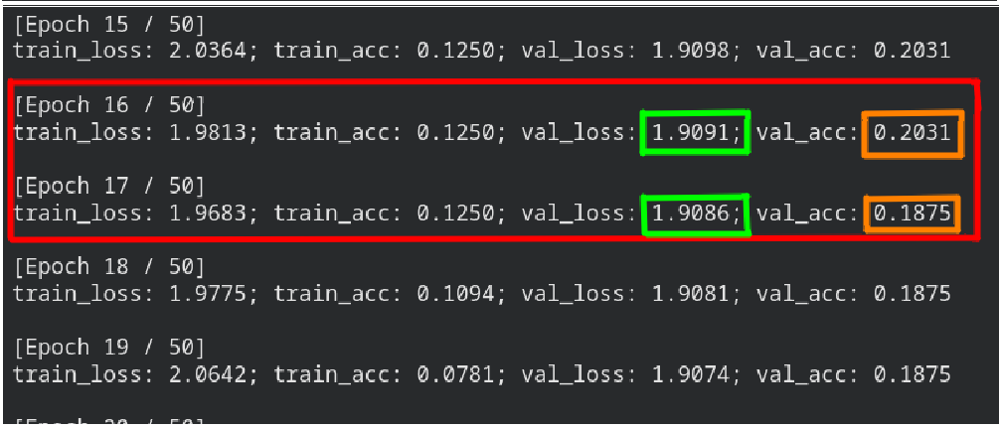

ესეც საინტერესო შემთხვევაა. *Loss*-ის გაუმჯობესებასთან ერთად *Accuracy* შემცირდა მე-16 და მე-17 ეპოქებს შორის. ერთი შეხედვით უცნაურია, მაგრამ ამ მაგალითითაც კარგად ჩანს *Loss* და *Accuracy*-ს შორის განსხვავება. *Loss* ფუნქცია *Accuracy*-სგან განსხვავებით ცდილობს *confidence*-ის მაქსიმიზაციასაც. ანუ, მაგალითად გვაქვს ორი sample X1, X2, რომლებისთვისაც y1=0, y2=1. დავუშვათ გვაქვს ორი ტიპის prediction:

* [1] (p(`y1=0`)=51%, p(`y1=1`)=49%) და (p(`y2=0`)=49%, p(`y2=1`)=51%)
* [2] (p(`y1=0`)=49%, p(`y1=1`)=51%) და (p(`y2=0`)=01%, p(`y2=1`)=99%)

*Accuracy*-ით შეფასებისას პირველი prediction ცალსახად უკეთესია, რადგან `acc_1 = 100%`, ხოლო `acc_2 = 50%`.
*Loss*-ით შეფასებისას მეორე prediction არის უკეთესი, რადგან `loss_1 = (-log(0.51)-log(0.51)) / 2 ~ 0.67`, ხოლო `loss_2 = (-log(0.49)-log(0.99)) / 2 ~ 0.36`.

ანუ, *Loss* გაუმჯობესდა პირველი *prediction*-დან მეორეზე გადასვლისას, თუმცა *Accuracy* შემცირდა. განსხვავება სწორედ იქიდან მოდის, რომ *Loss* **soft** ტიპის მეტრიკაა, ხოლო **Accuracy** უფრო **hard** ტიპის.  

ჩვენს შემთხვევაშიც დაახლოებით იგივე მიზეზი შეიძლება იწვევდეს იმ შედეგს, რომელიც ზედა სურათზე ვნახეთ.


### Weight Initialization

ნეირონული ქსელები ჯერ კიდევ წინა საუკუნეში იცოდნენ. თუმცა, *Neural Networks* და ზოგადად *Deep Learning* განსაკუთრებით პოპულარული ბოლო რამდენიმე ათწლეულში გახდა. ამის ერთ-ერთი მიზეზი ის არის, რომ წინა საუკუნეში როცა ტესტავდნენ ნეირონულ ქსელებს ხშირ შემთხვევაში არ მუშაობდა ისე, როგორც ამას მოელოდნენ. ეს შეიძლება გამოეწვია იმას, რომ მაშინ *Weight Initialization*-ს დიდი ყურადღება არ ექცეოდა. სწორი Weight Initialization იმდენად მნიშვნელოვანი ნაწილია კარგი ტრენინგისთვის, რომ ბოლო ათწლეულში ამ თემაზე უამრავი paper დაიწერა. ამ ნაწილში მოვსინჯე, რამდენად დიდი გავლენა შეიძლება ჰქონდეს პარამეტრების ინიციალიზაციას ტრენინგის პროცესზე. ამისათვის, გამოვიყენე pytorch-ის *hook api*. დავარეგისტრირე ჩემი TwoLayerFC-ის თითოეულ layer-ზე ფუნქციები:
```python
    # Activation hook
    def get_activation(layer_name, activations):
        def hook(module, input, output):
            activations.append({'layer_name': layer_name, 'layer': module, 'out': output.detach()})
    return hook

    # Gradient hook
    def get_gradient(layer_name, gradients):
        def hook(module, grad_input, grad_output):
            gradients.append({'layer_name': layer_name, 'layer': module, 'out': grad_output[0].detach()})
    return hook
```

* პირველი hook-ით ვიჭერ თითეული layer-ის output-ს
* მეორე hook-ით ვიჭერ dL/dout, ანუ *Loss*-ის წარმოებულს თითოეული layer-ის output-ის მიმართ.

ეს ყველაფერი wandb-ზეც ჩანს, თუმცა იქ თითოეული layer-ისთვის ცალკე არ აჩვენებს გრადიენტს/აუთფუთს, ამიტომაც ვარჩიე ჩემით მომეცადა ეს ექსპერიმენტები.

ყველა ექსპერიმენტში TwoLayerFC-ის ლეიერების ზომებია [48*48, 64, 7]. input-ად ავიღე ნორმალური განაწილებიდან დასემპლილი batch, ხოლო label-ის ელემენტები უბრალოდ დავარენდომე:
```python
    # Sample input from unit Gaussian
    batch = torch.randn(1000, 1, 48, 48)

    # Sample random labels for 7 classes
    labels = torch.randint(0, 7, (1000,))
```
ამის შემდეგ, ახლად დაინიციალიზებულ მოდელში შევუშვი ეს `batch` და ვნახე როგორი განაწილებები ექნებოდა output-ებს და gradient-ებს თითოეული layer-სთვის.


* თავიდან ვცადე წონების ინიციალიზაცია N(0, 3e-3)-დან, ანუ წონები საკმაოდ პატარა მნიშვნელობებით დავაინიციალიზე. ასევე, აქტივაციის ფუნქციად ავიღე `tanh`. მივიღე ასეთი შედეგი:

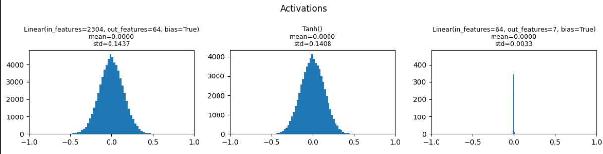


ვხედავთ, რომ თანდათან უფრო ღრმა layer-ში გადასვლისას output-ების მნიშვნელობები თანდათან მცირდება და ბოლოს საერთოდ 0-თან ძალიან ახლოსაა. ანუ ყველა აქტივაცია, ფაქტობრივად, 0 ხდება. რა შეიძლება მოხდეს backward pass-ის დროს? მაგალითად, წრფივ layer-ებში გვჭირდება `dL/dW`-ის გაგება თუ მოცემული გავქვს `dL/dout`, სადაც out ამ წრფივი ლეიერის output-ია, ანუ `out=X*W`. შესაბამისად, `dL/dW = dL/dout * dout/dW = dL/dout * X`, ანუ X-ზე მრავლდება ლეიერში შემოსული გრადიენტები, სადაც X წინა ლეიერის output-ია, ანუ ამ layer-ების input-ია. თუ X-ის ელემენტები თითქმის ნულია, მაშინ გრადიენტი განულდება და გვექნება **vanishing gradient** პრობლემა, ანუ პარამეტრების მიმართ გრადიენტები იქნება ნული და პარამატრების update არ მოხდება. 

გარდა ამისა, წრფივ ლეიერებში გავლისას გვჭირდება `dL/dx` -ის გამოთვლა თუ მოცემული გვაქვს dL/dout, სადაც x ამ ლეიერის input არის. `dL/dx`-ის დათვლის შემდეგ გადავალთ კიდევ უკანა layer-ებზე. `dL/dx = dL/dout * dout/dw = dL/dx * W`. თუ W-ის ელემენტები თითქმის ნულია (და ჩვენ შემთხვევაში ეგრეა, რადგან `std=3e-3`-ით დავაინიციალიზეთ წონები) მაშინ უკანა layer-ზე გადასული გრადიენტები განულდება ამ layer-ში გავლისას და აქაც **vanishing gradient** გვექნება.

ეს პრობლემა იმდენად მნიშვნელოვანი არ არის პატარა net-ებისთვის, მაგრამ იგივე ექსპერიმენტი ჩავატარე შედარებით ღრმა ნეირონული ქსელისთვის `layer_sizes=[48*48, 512, 512, 512, 512, 512, 7]` და weight-ების დავსემპლე N(mean=0, std=1e-2)-დან, ხოლო აქტივაციის ფუნქციად ისევ `tanh` ავირჩიე. მივიღე ასეთი შედეგი:

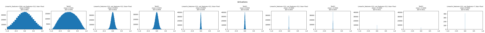

აქ ბევრად უფრო აშკარად ჩანს პრობლემა. თავიდან ნორმალური განაწილება აქვს output-ებს და თანდათან std მცრიდება და ბოლოს ნულდება:

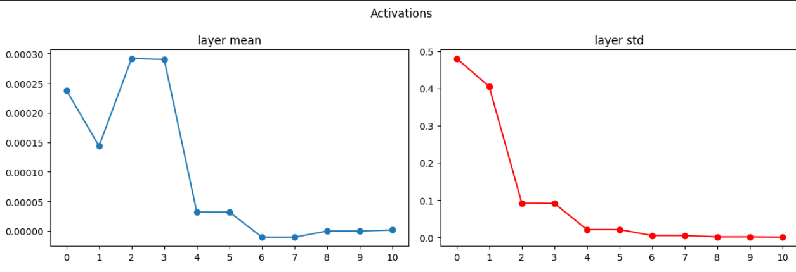

ეს დიდი ალბათობის გამოიწვევს *vanishig gradient* პრობლემას და მოდელის ტრენინგი უფრო გართულდება. ეს არ ნიშნავს იმას, რომ მოდელი აუცილებლად ვერ დატრენინგდება (თუმცა, ეგრეც შეიძლება მოხდეს). შეიძლება უფრო დიდი ხანი მოუნდეს და მეტი ეპოქა დასჭრიდეს ტრენინგისას.


* ამას გარდა, მოვსინჯე შემთხვევა, როცა წონების ინიციალიზაცია ისევ ნორმალური განაწილებით ხდება, უბრალოდ უფრო დიდი std=1-ით, ანუ N(mean=0, std=1). აქტივაციად ისევ `tanh` დავტოვე და ასეთი შედეგი მივიღე:

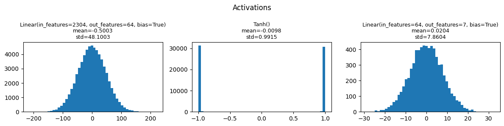

რადგან წონები შედარებით დიდი რიცხვებია, `Tanh` აქტივაციის layer-ის input-ებიც დიდი რიცხვები აღმოჩნდა. ამის მიზაზი ისაა, რომ წინა წრფივი layer-ის input X გამრავლდა W მატრიცაზე და W მატრიცის ელემენტები შედარებით დიდი რიცხვებია და საბოლოოს წინა layer-ის output ანუ `Tanh` აქტივაციის layer-ის input დიდი რიცხვები აღმოჩნდა. `Tanh` ბრტყელი ფუნქციაა კუდებში და მოხდა მისი სატურაცია. სატურაცია გამოიწვევს იმას, რომ გრადიენტები `Tanh`-ის ლეიერში ვერ გავლენ, რადგან `dtanh(x)/dx ~ 0` სატურირებული tanh-სთვის. ანუ, `dL/din = dL/dout * dout/din ~ 0`, რადგან `dout/din ~ 0` სატურირებული Tanh-ის აქტივაციის layer-სთვის. ანუ აქაც შეიძლება გქონდეს `vanishing gradient` პრობლემა. იგივე შედეგი კიდევ უფრო კარგად ჩანს უფრო ღრმა ნეირონული ქსელისთვის (წინაზე რაც გვქონდა იგივე ქსელია), როცა წონებს N(mean=0, std=1)-დან ავირჩევთ:

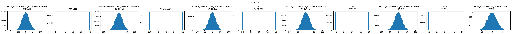

აქაც, სატურაციის პრობლემაა და ეგ კარგად ჩანს თითოეული აქტივაციის `Tanh` ლეირზე. 
აქვე საინტერესოა უშუალოდ გრადიენტები როგორ გამოიყურება. თუ დავაკვირდებით, Tanh layer-ის out-ების მიმართ შედარებით დიდია გრადიენტები ვიდრე წრფივ layer-ებზე. ამის მიზეზი ისაა, რომ წრფივ layer-ში შესული უკან მიმავალი გრადიენტი dL/dout მრავლდება W-ზე dL/din-ის გამოსათვლელად და თუ W-ს ელემენტები დიდია (როგორც ჩვენ გვაქვს ახლა აღებული), მაშინ dL/din შედარებით დიდი იქნება ვიდრე წრფივი layer-ების dL/dout, რომელიც პირდაპირ სატურირებული Tanh layer-ის უკან დგას და მისი გრადიენტები აშკარად ბევრად პატარა იქნება:

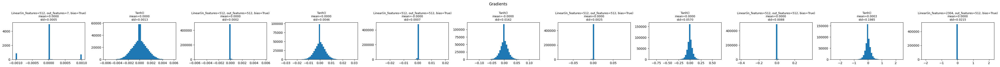

ზედა სურათზე პირიქითაა layer-ები დალაგებული, მარცხნივ უფრო სიღრმეში მყოფი layer-ებია და რაც უფრო მარჯვნივ მივდივართ უფრო მცირდება სიღრმე. 


შემდეგ მოვცადე `xavier_normal` ინიციალიზაცია, რომელიც თითოეული layer-ების წონებს ერთმანეთისგან დამოუკიდებლად ასკალირებს. მარტივად რომ ვთქვათ, რაც უფრო მეტი ნეირონია ერთ ლეიერში, მით უფრო დიდ რიცხვზე ყოფს ვარიაციას და რაც უფრო ცოტა ნეირონია ლეიერში მით უფრო პატარა რიცხვზე ყოფს ნორმალური განაწილების ვარიაციას და ასე აბალანსებს თითოეული ლეიერის ნეირონის ვარიაციას. ეს ინიციალიზაციაც მოვცადე და ასეთ შედეგი მივიღე:

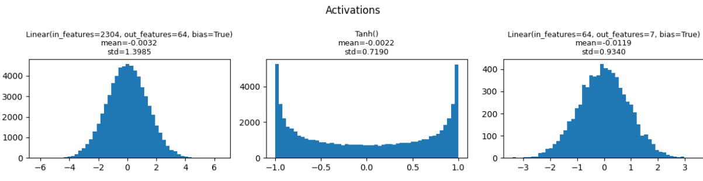

ბევრად უფრო დაასტაბილურა თითოეული ლეიერის output. ასეთი clean *forward pass*-ის შემდეგ გრადიენტების backward flow ბევრად უკეთესი ექნება networks წინებთან შედარებით. *xavier_normal*-ით წონების ინიციალიზაცია ასევე მოვცადე უფრო ღრმა network-ებისთვის და საგრძნობლად უკეთესი forward განაწილებები აქვთ output-ებს:

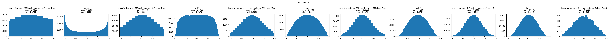

აქ თითქმის ნორმალური განაწილება აქვს ყველა layer-ს რაც უფრო სიღრმეში მივდივართ. ანუ xavier_normal-ით ინიციალიზაციის დროს Tanh-ების უფრო *active region*-ში ხვდება წინა ლეიერის output და უნდა მოველოდოთ, რომ დასაწყისში უფრო კარგად დატრენინგდება ამ ინიციალიზაციით ნეირონული ქსელები.

ისიც უნდა აღვნიშნოთ, რომ xavier_normal-ით ინიციალიზაცია ბოლომდე მაინც არ არის *vanishing gradient*-is პრობლემის გადაჭრა. ლოკალურად კარგი backward გრადიენტები შეიძლება გვქონდეს დასაწყისში, თუმცა რაც უფრო ღრმაა ნეირონული ქსელი, გრადიენტების ერთმანეთზე რეკურსიულად გადამრავლება backpropagation-ის დროს თანდათან ამცირებს გრადიენტს (განსაკუთრებით მაშინ, როცა აქტივაციის ფუნქცია Tanh-ია, რომლის გრადიენტი (-1, 1) შუალედშია). ამის გადასაჭრელად სხვა გზებია მოსაფიქრებელი. 

## Training

* ყველა ტრენინგისთვის გამოვიყენე EarlyStopper, რომელშიც ვიმახსოვრებდი საუკეთესო ეპოქის პარამეტრებს. საუკეთესო ეპოქას ვირჩევდი მინიმალური `val_loss`-ის მიხედვით.  

* ასევე, ჰიპერპარამეტრების რამდენიმე ვარიანტი ვცადე ამ მოდელის ტრენინგისას.  

* დავიწყე ზედა *sanity check* ნაწილის observation-ების შემოწმებით. გავტესტე შემდეგი ორი მოდელი:

- `TwoLayerFC__bs_64__hs_64__activation_Tanh__optimizer_Adam_lr_0.001_weight_decay_0__weights_init_normal_mean_0_std_1__early_stop_True_patience_50_min_delta_0`

- `TwoLayerFC__bs_64__hs_64__activation_Tanh__optimizer_Adam_lr_0.001_weight_decay_0__weights_init_xavier_normal__early_stop_True_patience_50_min_delta_0`

განსხვავება უბრალოდ იმაშია, რომ ერთ მოდელში `normal_mean_0_std_1` გამოვიყენე ცვლადების ინიციალიზაციისთვის, ხოლო მეორესთვის `xavier_normal` ინიციალიზაცია გამოვიყენე. ორივე აქტივაციის layer-ად ავიღე `Tanh` (ნაცრისფერი მოდელია `xavier_normal`, ხოლო იასამნისფერი - `normal_mean_0_std_1`): 

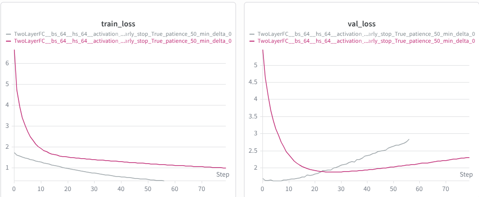

ამ შედეგიდან ჩანს, რომ `xavier_normal`-ით ინიციალიზებულ მოდელს ბევრად მაღალი წარმადობა აქვს. ანუ, ტრენინგის პროცესი ბევრად უფრო მალე მიდის ასეთ მოდელში - იმდენად მალე, რომ უფრო **overfitted** არის ვიფრე მეორე მოდელი, რომლის წონები `normal_mean_0_std_1`-ით დავაინიციალიზეთ. **overfit** დიდად არ არის გასაკვირი და ამის თავიდან ასაცილებლად სხვა გზების მოცდაა საჭირო, კარგი ინიციალიზაცია ვერ უშველის მაგ ნაწილს. ამით უბრალოდ ის ვაჩვენეთ, რომ ტრენინგის პროცესი ბევრად უფრო *smooth* არის პარამეტრების კარგი ინიციალიზაციის მქონე მოდელისთვის. 

`TwoLayerFC__bs_64__hs_64__activation_Tanh__optimizer_Adam_lr_0.001_weight_decay_0__weights_init_normal_mean_0_std_1__early_stop_True_patience_50_min_delta_0` -სთვის საუკეთესო შედეგზე გავიდა (`epoch: 7`, `train_loss: 1.4054`; `train_acc: 0.4691`; `val_loss: 1.6273`; `val_acc: 0.3723`)

`TwoLayerFC__bs_64__hs_64__activation_Tanh__optimizer_Adam_lr_0.001_weight_decay_0__weights_init_xavier_normal__early_stop_True_patience_50_min_delta_0` -სთვის საუკეთესო შედეგზე გავიდა (`epoch: 30`, `train_loss: 1.4029`; `train_acc: 0.4715`; `val_loss: 1.8894`; `val_acc: 0.3019`)

ასეთი დაბალი შედეგები იმიტომ არის `train_acc`-ში, რომ ადრინდელი ეპოქის შედეგი დავიმახსოვრეთ. ამ ეპოქის შემდეგ ორივე მოდელი წავიდა **overfit**-ში და ვალიდაციაზე უარესს შედეგს დებდა. ანუ გვჭირდება რაიმე რეგულარიზაციის მექანიზმი.


* `Tanh` აქტივაცია ხშირ შემთხვევაში პრობლემურია, რადგან backpropagation-ის დროს `Tanh` ლეიერში შესული გრადიენტი მრავლდება (-1, 1) რიცხვზე, რადგან `-1 < dtanh(x)/dx < 1`. შესაბამისად, მოვცადე `ReLU` აქტივაციის გამოყენება. `ReLU`-ს აქტივაციისთვის `kaiming_normal` ინიციალიზაციას იყენებენ - `xavier_normal`-ის მსგავსია, უბრალოდ დამატებით 2-ზე ყოფს მნიშნელს,რადგან `ReLU` ორჯერ ამცრირებს layer-ის ვარიაციას. ასევე, აქვე ვცადე l2 რეგულარიზაციის პარამეტრის `weight_scale`-ის ცვლილება [`1e-6`, `1e-5`, `1e-4`, `1e-3`, `1e-2`, `1e-1`, `0`]. რეგულარიზაციის გარეშე `Tanh`-ზე უკეთესი შედეგი მოგვცა `TwoLayerFC__bs_64__hs_64__activation_ReLU__optimizer_Adam_lr_0001_weight_decay_0__early_stop_True_patience_50_min_delta_0` მოდელმა: (`epoch: 5`, `train_loss: 1.4296`; `train_acc: 0.4530`; `val_loss: 1.5837`; `val_acc: 0.3925`). ანუ `val_loss` შემცირდა და `val_acc` გაიზარდა. რეგულარიზაციით საუკეთესო შედეგი მოგვცა `weight_scale=1e-3`-ის მოდელმა (`epoch: 4`, `train_loss: 1.4705`; `train_acc: 0.4403`; `val_loss: 1.5785`; `val_acc: 0.3955`). `val_loss` და `val_acc` ოდნავ გაუმჯობესდა ამ მოდელების შემთხვევაში.  ამ მოდელებზე best_epoch-ები პატარა რიცხვებია (4, 5, 6), რაც იმაზე მიუთითებს რომ ეს მოდელები **overfit**-ში მიდიან მალევე და ვალიდაციის შედეგები უარსედება (სხვათაშორის, `Tanh` და `normal_`-ზე შედარებით დიდი იყო best_epoch=30, რაც იმაზე მიუთითებს, რომ ნელა სწავლობდა ცუდი ინიციალიზაციის გამო). ამის გამო, რეგულარიზაციის სხვა ხერხს მივმართე.


* ამ ეტაპზე უკვე გამოვიყენე dropout, რომელიც რეგულარიზაციის ეფექტიანი ხერხია. რადგან `ReLU` აქტივაციამ და `kaiming_normal` ინიციალიზაცია უკეთეს წარმადობას აძლევდა ნეირონულ ქსელს, ეს ორი ჰიპერპარამეტრი დავტოვე და ახლა dropout-ის `p` ჰიპერპარამეტრი ვცადე. თავიდან გადავარჩიე `p = [.3,  .5, .7]` მნიშვნელობები. აქედან საუკეთესო შედეგი `p=.3`-მა დადო. ამის შემდეგ `p=.3`-ის ირგვლივაც გადავარჩიე რამდენიმე (.1, .2, .4), მაგრამ `p=.3`-მა ყველას აჯობა და დადო ასეთი შედეგი (`epoch: 15`, `train_loss: 1.3996`; `train_acc: 0.4675`; `val_loss: 1.5573`; `val_acc: 0.4034`). საუკეთესო ეპოქა ოდნავ გაიზარდა და დაეტყო მოდელს dropout-ის რეგულარიზაციის effect. ანუ მოდელი თავიდანვე **overfit**-ში არ წავიდა და ოდნავ გენერალიზაცია ისწავლა წინებთან შედარებით.

* dropout-იან მოდელებს როცა ვაკვირდებოდი, შევნიშნე, რომ `val_acc` ზედმეტად ხმაურიანია და ზიგზაგზე დადის. 

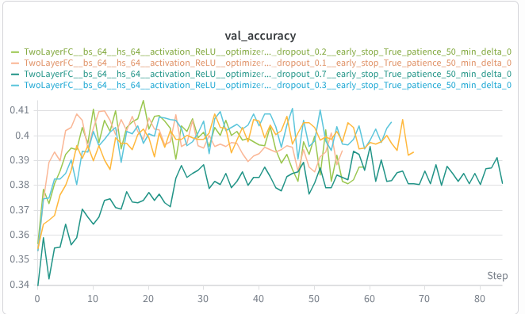

`val_acc` გრაფიკის ასეთი ქცევის ერთ-ერთი მიზეზი შეიძლება იყოს ზედმეტად მაღალი `learning_rate`. აქამდე სულ `learnign_rate = 1e-3` მქონდა აღებული. შესაძლოა  `learning_rate` ზედმეტად დიდი იყოს convergence-ის დროს და ეს იწვევდეს  `val_acc`-ის ასეთ ფორმას. საცდელად ავიღრე `learning_rate=1e-4` და `dropout=.3` და ასეთი შედეგი მივიღე:

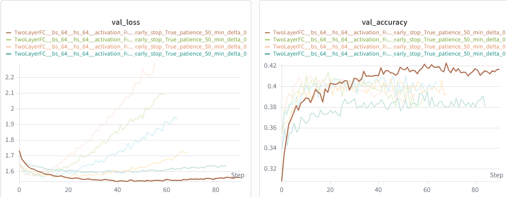

ბევრად გაუმჯობესდა შედეგი: (`epoch: 41`, `train_loss: 1.3756`; `train_acc: 0.4829`; `val_loss: 1.5345`; `val_acc: 0.4104`). საუკეთესო ეპოქაც ბევრად გაიზარდა, რაც იმას ნიშნავს, რომ მოდელი ბევრად მეტი დროის განმავლობაში ამცირდებდა `val_loss` და ოდავ უკეთესს გენერალიზაციასაც ვიღებთ.

კიდევ უფრო უკეთესი შედეგი მივიღე როცა `lr=5e-5` მოვცადე (`epoch: 89`, `train_loss: 1.3457`; `train_acc: 0.5015`; `val_loss: 1.5327`; `val_acc: 0.4199`):

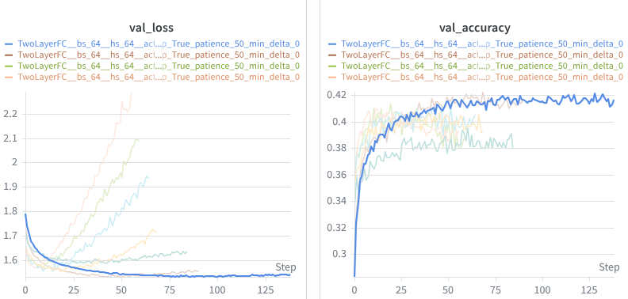

უკეთესი convergence აქვს ამ მოდელს და თან ეპოქების რაოდენობაც იზრდება, რადგან learning_rate უფრო პატარაა და მეტი ნაბიჯი სჭირდება მოდელს convergence-სთვის. 

---

# Multi Layer FC

## Sanity Check

* აქაც ანალოგიური შემოწმებები ჩავატარე და ყველამ იმუშავა. წონების ინიციალიზაციის შემოწმებები TwoLayerFC-ის *Sanity Check* ნაწილში მქონდა განხილული.


## Training

* დავიწყე შედარებით მარტივი, თუმცა უფრო ღრმა არქიტექტურით: `hidden_sizes = [512, 512, 256, 128]`. `learning_rate = 1e-4` ავირჩიე. დანარჩენი იგივე დავტოე და ასეთი შედეგი მივიღე:

MultiLayerFC__bs_64__hs_[512, 512, 256, 128]__activation_ReLU__optimizer_Adam_lr_0.0001_weight_decay_0__early_stop_True_patience_50_min_delta_0 -სთვის (`epoch: 4`, `train_loss: 1.3797`; `train_acc: 0.4849`; `val_loss: 1.5387`; `val_acc: 0.4055`). წინა default-ზე უკეთესი შედეგი მივიღეთ. თუმცა, აქაც **overfit**-ის პრობლემაა. 

* წინა არქიტექტურისგან განსხვავებით ეს მოდელი უფრო deep არის შესაბამისად გრადიენტების კონტროლი აქ უფრო მნიშვნელოვანია. გრადიენტების რეგულაციის კარგი ვარიანტია *Normalization layer*-ების დამატება. თუ გვინდა, რომ დაახლოებით Gaussian input ჰქონდეს ყველა აქტივაციას layer-ის წინ, შეგვიძლია უბრალოდ დავამატოთ layer, რომელიც დაანორმალიზებს დატას activation layer-ში შესვლის წინ. შესაბამისად, არსებულ მოდელს დავამატე *Layer Normalization* ლეიერი, რომელიც აქტივაციაში შემავალ ყველა datapoint-ს სათითაოდ დაანორმალიზებს. ამას გარდა, დავამატე dropout layer `p=0.5` ჰიპერპარამეტრით: (`epoch: 45`, `train_loss: 1.4201`; `train_acc: 0.4548`; `val_loss: 1.5247`; `val_acc: 0.4108`). ცუდი შედეგი არ არის. `val_acc` ოდნავ გაგვეზარდა. 

* ამის შემდეგ batchnorm მოვცადე, რომელიც batch-ის ყოველ feature-ს ასკალირებს datapoint-ის ნაცვლად. ამასთან ერთად, შევამცირე learning_rate `1e-4`-მდე და შევამცირე dropout-ის `p` 0.3-მდე. შედეგი გაუმჯობესდა: (`epoch: 29`, `train_loss: 1.3798`; `train_acc: 0.4691`; `val_loss: 1.4855`; `val_acc: 0.4273`). 


ამ ექსპერიმენტებით გამოჩნდა, რომ არც ისე კარგ შედეგებს დებს MLP მოდელი სურათის კლასიფიკაციაზე. თანაც, რაც უფრო მეტ layer-ს ვამატებთ, მით უფრო რთული ხდება **overfit**-ის თავიდან არიდება. მოდელი სურათის პიქსელების პოზიციას ერთმანეთის მიმართ ვერ სწავლობს, რადგან როგორც კი მოდელს გადავცემთ 48x48 სურათს, მაშინვე Flatten(x)-ით ვაბრტყელებთ x-ს და იკარგება სივრცული კონფიგურაცია, რომელიც ამ პიქსელებს შორის იქმნებოდა და მოდელს ან ხელახლა უწევს ამ ყველაფრის სწავლა და საქმეს ვურთულებთ ან 'იზეპირებს' და შესაბამისად დაბალი შედეგები აქვს ვალიდაციაზე. 

სურათების კლასიფიკაციაში შეიძლება დაგვეხმაროს CNN არქიტექტურა, რომელიც სურათებთან სამუშაოდ ძალიან კარგია. CNN არ უკარგავს სურათს სივრცულ კონფიგურაციას. Convolutional Layer-ები პირდაპირ სურათზე მუშაობენ და ფილტრებით გადავლისას სწავლობენ **მეზობელ** პიქსელებში პატერნებს. 

---

# CNN


## SimpleCNN

* დავიწყე მარტივი CNN-ის დატრენინგებით. ავიღე ორი ცალი Convolutional Layer-ით:

```python
    self.conv = nn.Sequential(
        nn.Conv2d(1, 64, kernel_size=3, padding=1),
        nn.BatchNorm2d(64),
        nn.ReLU(),
        nn.MaxPool2d(kernel_size=2),

        nn.Conv2d(64, 128, kernel_size=3, padding=1),
        nn.BatchNorm2d(128),
        nn.ReLU(),
        nn.MaxPool2d(kernel_size=2),
    )
```

თითოეულ Convolutional Layer-ზე pooling-ამდე ვინარჩუნებ შესული სურათის widht და height განზომილებებს. Conv Layer-ში 3x3 კერნელს ვიყენებ და იმისათვის, რომ width და height  არ შეუმცირდეს სურათს 1 ზომის padding-ს ვუმატებ width და height-ზე. ამის შემდეგ ვაკეთებ Batchnorm2d channel-ების გასწვრივ, რათა პიქსელები ნორმალიზებული დავტოვო შემდეგ აქტივაციის ReLU layer-ში შესვლამდე. ბოლოს ვაკეთებ pooling-ს 2x2 კერნელით. თანდათან სურათის width და height მცირდება pooling-ის შემდეგ, მაგრამ channel-ების რაოდენობა იმატებს. ბოლოს უკვე გავაბრტყელე სურათის Conv Layer-ების დამუშავებული feature-ები და შევუშვი MLP-ში: 

```python
    self.mlp = nn.Sequential(
        nn.Flatten(),
        nn.Linear(128 * 12 * 12, 256),
        nn.ReLU(),
        nn.Linear(256, num_classes),
    )
```

* `128 * 12 * 12` იქნება ნეირონების რაოდენობა, რადგან 128 არის channel-ების რაოდენობა, ხოლო 12x12 გახდება სურათი მას შემდეგ, რაც 48x48 სურათი ორჯერ გაივლის 2x2 კერნელის მქონე pooling ლეიერში.

* forward ძალიან მარტივი გამოვიდა:
```python
    def forward(self, x):
        return self.mlp(self.conv(x))
```

ამ არქიტექტურის ორი მოდელი გავუშვი სხვადასხვა learning_rate-ით (`lr=1e-4` და `lr=5e-5`) და საუკეთესო შედეგი დადო `lr=5e-5`-ის მქონე მოდელმა: 

- SimpleCNN__conv_64-128__fc_256__BN__noDrop__bs_64__Adam_lr_5e-05_wd_0 -ის შედეგია (`epoch: 10`, `train_loss: 0.9130`; `train_acc: 0.6839`; `val_loss: 1.2774`; `val_acc: 0.5309`).

ბევრად უკეთესია შედეგია, ვიდრე MLP-ები. აქაც ჩანს, რომ CNN-ის Conv Layer-ები უფრო მარტივად პოულობენ კარგ feature-ებს შემოსულ სურათზე. მეორემ ასეთი შედეგი დადო: (`epoch: 6`, `train_loss: 1.0687`; `train_acc: 0.6051`; `val_loss: 1.2882`; `val_acc: 0.5160`). არც ეს არის ცუდი შედეგი, მაგრამ წინა ჯობდა. 


* რადგან **overfitting**-ის პრობლემა მუდმივად არის (განსაკუთრებით დიდი capacity-ს მქონე მოდელში) დავამატე Dropout layer. ჯერ dropout layer -ის დამატება მოვცადე მხოლოდ MLP layer-ში და ასეთი შედეგები მივიღე:

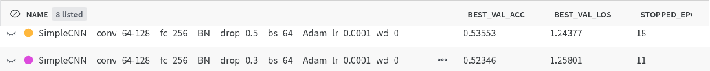

`dropout_p = 0.5`-მა აშკარად უკეთესი შედეგი მოგვცა და ოდნავ გაუმჯობესდა ჩვენი მოდელის performace ვალიდაციაზე.

რადგან dropout-მა კარგად იმუშავა MLP layer-ში გადავწყვიტე დამემატებინა Conv Layer-ებშიც. `dropout2d_p=0.25` ავირჩიე Conv layer-ების dropout-ის ჰიპერპარამეტრად. ამანაც გააუმჯობესა შედეგი:


ამის შემდეგ გადავწყვიტე ოდნავ გამეზარდა MLP layer-ის კომპლექსურობა და მენახა რა შედეგი მოყვებოდა მაგას:
```python
    self.mlp = nn.Sequential(
        nn.Flatten(),
        nn.Linear(128 * 12 * 12, 256), nn.ReLU(), nn.Dropout(.5),
        nn.Linear(256, 256), nn.ReLU(), nn.Dropout(.5),
        nn.Linear(256, num_classes),
    )
```
ანუ კიდევ ერთი წრფივი ლეიერი დავამატე თავის აქტივაციით და ა.შ. ასეთი შედეგი დამისვა:


აქაც გაგვიუმჯობესდა ვალიდაციაზე პერფორმანსი.


ამის შემდეგ კიდევ რამდენიმე ჰიპერპარამეტრის ცვლილება, მაგრამ შედეგი არ გამოიმჯობესდა. გადავწყვიტე, რომ არქიტექტურის scaling გამეკეთებინა. ხშირად გამიგია ML-ში scaling კარგად მუშაობსო და ვცადე ბევრი Conv Layer-ის დამატება და ამ არქიტექტურას დავარქვი `DeepCNN`. 

## DeepCNN

* რადგან scaling-ს ვაკეთებთ, უფრო მეტი Conv Layer დავამატე ჩვენს `SimpleCNN` არქიტექტურას და გამოვიდა `DeepCNN` არქიტექტურა:

```python
    self.conv = nn.Sequential(
        nn.Conv2d(1, 64, 3, padding=1), nn.BatchNorm2d(64), nn.ReLU(),
        nn.Conv2d(64, 64, 3, padding=1), nn.BatchNorm2d(64), nn.ReLU(),
        nn.MaxPool2d(2), nn.Dropout2d(0.25),

        nn.Conv2d(64, 128, 3, padding=1), nn.BatchNorm2d(128), nn.ReLU(),
        nn.Conv2d(128, 128, 3, padding=1), nn.BatchNorm2d(128), nn.ReLU(),
        nn.MaxPool2d(2), nn.Dropout2d(0.25),

        nn.Conv2d(128, 256, 3, padding=1), nn.BatchNorm2d(256), nn.ReLU(),
        nn.Conv2d(256, 256, 3, padding=1), nn.BatchNorm2d(256), nn.ReLU(),
        nn.MaxPool2d(2), nn.Dropout2d(0.25),

        nn.Conv2d(256, 512, 3, padding=1), nn.BatchNorm2d(512), nn.ReLU(),
    )
```

* ფუნდამენტურად იგივეა, რაც `SimpleCNN` უბრალოდ ყველაფერი აქვს უფრო მეტი. ვნახოთ ეს როგორ იმუშავებს. MLP Layer არ შემიცვლია და იგივე დავტოვე, როგორიც `SimpleCNN`-ში გვქონდა:


ანუ მართალი ყოფილა ის ფაქტი, რომ scaling შველის. თითქმის 60% გახდა ვალიდაციის accuracy უბრალოდ იმის ხარჯზე, რომ layer-ების რაოდენობა გავზარდეთ ჩვენს მოდელში, დამატებით ისეთი არაფერი. რადგან Conv Layer-ებისდ დამატებამ უშველა, ვიფიქრე, MLP ნაწილსაც გავართულებ და დავამატებ კიდევ ერთ ლეიერს-თქო, მაგრამ ოდნავ გაუარესდა შედეგი: `val_acc=0.59754`-ზე ჩამოვარდა. 


 


## ფაილების აღწერა

* facial-expression-recognition-01.ipynb   - EDA, მონაცემების ანალიზი
* facial-expression-recognition-02.ipynb   - საუკეთესო მოდელის ჩამოტვირთვა და პროგნოზი
* ieee-fraud-model-*.ipynb                 - სხვადასხვა DataProcessing-ის მიდგომები  და სხვადასხვა არქიტექტურის მოდელების ექსპერიმენტები მოცემული DataProcessing-ის მიხედვით (თითო preprocessing მიდგომა და model architecture თითო ფაილში). 

---

*ieee-fraud-model-\*.ipynb* ფაილების სტრუქტურა მსგავსია:

## Read & Split Data

* წავიკითხე **data**.csv და ვინახავ DataFrame ობიექტებში.


* დავყავი **data** სამ ნაწილად: *train*, *validation*, *test*.

## Data Cleaning

* შევქმენი custom ან sklearn ბიბილიოთეკის pipeline-ის ობიექტები სვეტებთან სამუშაოდ. 


* feature-ები, რომლების დამუშავებასაც ერთნაირი მიდგომებით ვაპირებ, ერთად დავაჯგუფე.


* ყოველი ჯგუფისთვის შევქმენი მცირე pipeline, რომლებსაც საბოლოოდ აერთიანებს *preprocessor* ობიექტი. 

## Preprocessing Pipeline

* ამ ნაწილში ერთ *preprocessor* ობიექტში ვაერთიანებ ყველა წინა მიღებულ Data Cleaning ობიექტებს. 

მაგალითად:
```python
preprocessor = Pipeline([
    ('col_dropper', col_dropper),
    ('na_imputer',  imputer),
    ('scaler',      scaler),
    ('rfe',         selector),
])
```


## Full Pipeline

* ამ წაწილში უკვე ვაწყობ *full_pipeline* მოდელს, რომელიც *preprocessor*-თან ერთად მოიცავს რომელიმე არქიტექტურის მოდელსაც.

მაგალითად: 
```python
full_pipeline = Pipeline([
    ('preprocessor', preprocessor),
    ('model',        LogisticRegression()),
])
```

### MLflow Logging

* საბოლოო pipeline-ს შესაძლოა ჰქონდეს ბევრი ჰიპერპარამეტრი, როგორც preprocessing, ისე მოდელის არქიტექტურის ნაწილში.


* შესაბამისად, ამ ნაწილში გადავარჩევ ორივე ნაწილის ჰიპერპარამეტრებს GridSearch სტილში, პარალელურად ვქმნი შესაბამის **experiment**-ებსა და **run**-ებს **MLflow**-ზე და ვლოგავ პარამეტრების თითოეული კომბინაციის მეტრიკებს, პარამეტრებს და მთლიან *full_pipeline* ობიექტს.


---

# General Remarks

*ieee-fraud-model-\*.ipynb* თითოეული ფაილში preprocessing-ის სხვადასხვა მიდგომა მაქვს. შესაბამისად, preprocessing მიდგომების ერთიანად აღწერა ერთ პუნქტში საკმაოდ რთულია. აჯობებს მოდელების არქიტექტურების მიხედვით თანმიმდევრულად განვიხილოთ მიდგომები, შედეგები და საინტერესო ქცევები, რომლებიც cross validation პროცესში გამოჩნდა.

თუმცა, სანამ უშუალოდ თითოეული არქიტექტურისთვის მიდგომების აღწერაზე გადავალთ, ზოგადად განვიხილოთ რა **data** დამხვდა, რა იყო პირველი ნაბიჯები. ეს ყველაფერი საერთოა თითოეული *ieee-fraud-model-\*.ipynb* ფაილისთვის:   

* დამხვდა ორ-ორი csv ფაილი, *train_transaction.csv*, *train_identity.csv* და *test_transaction.csv*, *test_identity.csv*. train-ის ორივე ფაილში ჩავიხედე. ამ ორ ფაილს საერთო ჰქონდათ `TransactioID` სვეტი. *train_identity.csv*-ის `TransactioID`-ის სვეტის მნიშვნელობები *train_transaction.csv*-ის `TransactioID`-ის ქვესიმრავლე იყო. ანუ, *train_identity.csv*-ში მხოლოდ ზოგიერთი ტრანზაქციისთვის მოგვცეს დამატებითი ცვლადები, რომლებიც მოპოვებაც შეძლეს. ვვარაუდობ, რომ ორად უბრალოდ მეხსიერების დაზოგვისთვის მიზნით დააცალკევეს *\*_transaction* და *\*_identity* ფაილები და განსაკუთრებული მიზეზი არ უნდა ჰქონდეს.

* *train_transaction.csv*, *train_identity.csv* დავაჯოინე ერთმანეთთან და მივიღე:
```python
    df = pd.merge(df_transaction, df_identity, on='TransactionID', how='left')
    print('Train shape:', df.shape)
    
    --- Train shape: (590540, 434) ---
```
**datapoint**-ების რაოდენობა საკმაოდ ბევრია, ანუ ეს ამოცანა computation-ის მხრივ *complex* და *expensive* შეიძლება იყოს.


* ამის შემდეგ შევხედე გავაკეთე data split. რადგან **datapoint**-ების რაოდენობა ისედაც საკმაოდ დიდია, გადავწყვიტე, რომ *kfold cross validation* არ არის საჭირო ამ ეტაპისთვის. ავირჩიე შედარებით უფრო მარტივი მიდგომა და `df` დავყავი `train_df`, `val_df`, `test_df` ნაწილებად. აქ ერთი მარტივი მიდგომა იქნებოდა, რომ `df` დამეყო randomized გზით, თუმცა ეს მიდგომა არც ისე სწორი გამოდგებოდა. ჩავთვალე, რომ ამოცანის მთავარი მიზანია მომავალში შემოსული ტრანზაქციის თაღლითურობის დადგენა. შესაბამისად, მონაცემების randomized გზით დაყოფის შემთხვევაში `train_df`-ში მოხვედრილი ტრანზაქციები შესაძლოა დროით უსწრებდეს `val_df` ან `test_df`-ში ჩავარდნილ ტრანზაქციებს. შესაბამისად, `train_df`-ით მოდელი ისწავლის 'მომავლის' პატერნებს და `val_df`-ზე ან `test_df` ბევრად უფრო ოპტიმისტური შედეგები ექნება მოდელს, ვიდრე ეს რეალობაში იქნება deployment-ის დროს. ამიტომ, გადავწყვიტე მოდელი დამეყო `TransactionDT` სვეტის მიხედვით 70/15/15 განაწილებით:
```python
    sorted_df = df.sort_values(by='TransactionDT')

    train_size = int(sorted_df.shape[0] * .7)
    val_size   = int(sorted_df.shape[0] * .15)

    train_df = sorted_df.iloc[:train_size]
    val_df   = sorted_df.iloc[train_size: train_size + val_size]
    test_df  = sorted_df.iloc[train_size + val_size:]
```

* ამას გარდა, კიდევ ერთი მნიშვნელოვანი ნაწილი იყო **data prevalence**-ის გაგება, ანუ მონაცემები **imbalanced** იყო თუ არა. ამისათვის ავაგე plot პროცენტულობით:


ვხედავთ, რომ მონაცემები საკმაოდ დაუბალანსებულია. შესაბამისად, მნიშვნელოვანია, რომ ზემოთ დროის მიხედვით დაყოფილ `train_df`, `val_df`, `test_df`, **0.035**-თან ახლოს იყოს **prevalence**-ები:
```python
    print('Train shape:',      train_df.shape, '\nTrain prevalence:',      train_df[TARGET].sum() / train_df.shape[0], '\n')
    print('Validation shape:', val_df.shape,   '\nValidation prevalence:', val_df[TARGET].sum()   / val_df.shape[0],   '\n')
    print('Test shape:',       test_df.shape,  '\nTest prevalence:',       test_df[TARGET].sum()  / test_df.shape[0],  '\n')

    --- Train shape: (413378, 434)                  --- 
    --- Train prevalence: 0.03516878014795175       ---

    --- Validation shape: (88581, 434)              ---
    --- Validation prevalence: 0.03434145019812375  ---

    --- Test shape: (88581, 434)                    ---
    --- Test prevalence: 0.03480430340592226        ---
```
ვხედავთ, რომ სამივე ნაწილს დაახლოებით ტოლი **prevalence** აქვთ, ანუ ამ მხრივ, პრობლემა არ გვაქვს. 

---

# Additional Technical Remarks

* რადგან ძალიან დიდი რაოდენობის **datapoint** გვაქვს, ტრენინგის ნაწილი დროის მხრივ საკმაოდ ძვირი აღმოჩნდა. მაგალითად, `Logistic Regression`-ის **l1** რეგულარიზაციის **saga** მოდელს 4 საათი ველოდე (**l2** რამდენიმე წუთში რჩებოდა, რადგან მათემატიკურად უფრო მარტივი დაოპტიმიზებადია). მარტო **cpu**-ით ძალიან რთული იქნებოდა უფრო დიდი მოდელების ტრენინგი. შესაბამისად, გამოვიყენე kaggle-ის **gpu**-ები (**30h** quota per week). **gpu**-ებით 4 საათის საქმე რამდენიმე წამში კეთდებოდა და ძალიან დამეხმარა cross validation პროცესში. თუმცა, **gpu**-ს გამოსაყენებლად გვჭირდება თვითონ პითონის ობიექტს ჰქონდეს ამის support. აღმოჩნდა, რომ **sklearn**-ის უმეტეს ობიექტებს ასე პირდაპირ არ აქვთ support, თუმცა არსებობს **cuml** ბიბლიოთეკა, რომელსაც **sklearn**-ის ანალოგი მოდელები აქვს და **gpu**-ს support-იც აქვს. მაგალითად, გამოვიყენე cuml.LogisticRegression sklearn.LogisticRegression-ის ნაცვლად. თუმცა, sklearn.LogisticRegression-სგან განსხვავებით, cuml.LogisticRegression-ს ერთადერთი `solver` აქვს, qn (Quasi-Newton). მაგრამ, `solver`-ს ზოგადად დიდი მნიშვნელობა არ აქვს, ყველა `solver` საბოლოო ჯამში ერთ ოპტიმალურ კოეფიციენტების წერტილში მიდის. ამიტომაც, გამოვიყენე **gpu-accelerated** cuml.LogisticRegression. აქვე უნდა აღინიშნოს, რომ cuml.LogisticRegression-ს გასაშვებად **gpu** აუცილებლად სჭირდება. მაგრამ, MLflow-ზე შენახული *full_pipeline*-ის ჩამოტვირთვისას შეიძლება მარტო **cpu** მქონდეს მოცემულ მანქანაზე. ამ პრობლემის გადასაჭრელად, გამოვიყენე cuml.LogisticRegression-ის `as_sklearn` ფუნქცია, რომელსაც cuml.LogisticRegression გადაჰყავს sklearn.LogisticRegression ობიექტში:
```python
    sklearn_model = cuml_model.as_sklearn()
```
**gpu** ძალიან კომფორტული აღმოჩნდა და საინტერესო გამოცდილება იყო.


---

# Back To Models

ახლა, შეგვიძლია გადავიდეთ უშუალოდ მოდელების ნაწილზე.

---

# Logistic Regression

## Preprocessing

მიდგომა საკმაოდ მარტივია:

* გადავაგდე არაინფორმაციული სვეტები:
```python
# TransactionId is not informative feature so we remove it

irrelevant_cols = [
    'TransactionID',
]

irrelevant_cols_dropper = ColumnTransformer(
    transformers=[
        ('drop', 'drop', irrelevant_cols),
    ],
    remainder='passthrough',
    verbose_feature_names_out=False,
).set_output(transform='pandas')
```

* რიცხვით სვეტებში **NA**-ის შევსება ვცადე ორი მიდგომით: *median* და *mean*. ეს ორი სხვადასხვა ექსპერიმენტში დავლოგე.


* კატეგორიული სვეტები შევავსე TargetEncoding-ით, რომელიც სვეტში თითოეულ კატეგორიას ანაცვლებს მისი target (isFraud) საშუალო მნიშვნელობით. ეს მიდგომა იმიტომ ავირჩიე, რომ ერთი - მარტივია baseline-სთვის და მეორე - სვეტში ისეთ კატეგორიას, რომლისთვისაც fraud ტრანზაქციის rate მაღალია, დიდ მნიშვნელობას მიანიჭებს, ხოლო ისეთ კატეგორიას, რომლისთვისაც fraud ტრანზაქციის rate დაბალია, პატარა მნიშვნელობას მიანიჭებს.


* ამის შემდეგ მთლიანი data დავანორმალიზე *StandardScaler*-ით. ეს საჭიროა რეგულარიზაციისთვის, რადგან წონები თანაბრად შ 


* სვეტები high NA-ს გამო აქ არ გადამიგდია. შესაძლოა ის, რომ ტრანზაქციის feature არის NA, პირიქით, მიანიშნებდეს იმაზე, რომ ტრანზაქვია არის ან არ არის fraud.  

## Training & Results

* ტრენინგის დროს მოდელებს გადავეცი `'class_weight': ['balanced']`, რადგან უფრო მეტი წონა მიანიჭონ უმცირესობის კლასს `loss` ფუნქციაში. `undersampling` ვცადე, მაგრამ ოდნავ უარეს შედეგებს მიდებდა *LogisticRegression*-ზე ამიტომ `class_weight`-ის მინიჭებები გადავწყვიტე. ასევე, შევნიშნოთ, რომ *LogisticRegression* აქვს **C** პარამეტრი, რომელიც რეგულარიზაციის პარამეტრის უკუპროპორციულია.


* ამ preprocessing-ით დავატრენინგე რამდენიმე არქიტექტურა (`l1`, `l2`, `elasticnet`) და გადავარჩიე ბევრი რეგულარიზაციის პარამეტრი:
```python
    model_configs_l1 = {
        'C':            [1e-5, 5e-5, 1e-4, 5e-4, 1e-3, 5e-3, 1e-2, 5e-2, 1e-1, 5e-1, 1, 5, 10, 50, 100, 500, 1000, 5000, 10000, 100000, np.inf]
        'penalty':      ['l1',],
        'solver':       ['qn'],
        'class_weight': ['balanced'],
        'max_iter':     [10000],
    }
    
    model_configs_l2 = {
        'C':            [1e-5, 5e-5, 1e-4, 5e-4, 1e-3, 5e-3, 1e-2, 5e-2, 1e-1, 5e-1, 1, 5, 10, 50, 100, 500, 1000, 5000, 10000, 100000, np.inf]
        'penalty':      ['l2',],
        'solver':       ['qn'],
        'class_weight': ['balanced'],
        'max_iter':     [10000],
    }

    model_configs_elasticnet = {
        'penalty':       ['elasticnet'],
        'C':             [1e-4, 5e-4, 1e-3, 5e-3, 1e-2, 5e-2, 1e-1, 5e-1, 1, 5, 10, 100, 1000, 10000],
        'l1_ratio':      [.1, .3, .5, .7, .9], 
        'class_weight':  ['balanced'],
        'solver':       ['qn'],
        'max_iter':      [10000],
    }
```

* ეს შედეგები ერთმანდეთს შევადარე და საკმაოდ საინტერესო პატერნები გამოჩნდა. მაგალითად, ეს არის l1 და l2 რეგულარიზაციის მოდელების plot-ები:


* `C=1e-5` ანუ დიდი რეგულარიზაციის პარამეტრის დასეტვის დროს, l2-ს უკეთესი შედეგები აქვს. ამის მიზეზი ის არის, რომ l2 რეგულარიზაცია **smooth** არის ანუ ბოლომდე არ ანულებს ცვლადების წონებს მაღალი რეგულარიზაციის კოეფიციენტის დროსაც კი. l1 რეგულარიზაცია შედარებით **sharp** არის და ცვლადების კოეფიციენტებს პირდაპირ ანულებს, განსაკუთრებით მაღალი რეგულარიზაციის კოეფიციენტის დროს. შესაბამისად, l1-ის შემთხვევაში **underfit** ბევრად უფრო მკვეთრად ჩანს. მაღალი რეგულარიზაციის კოეფიციენტის გამო მოდელს უწევს ბევრი feature -ის წონის განულება. l2 ამ დროს სავარაუდოდ ყველა წონის შემცირების ხარჯზე ახერხებს უკეთესი შედეგის აღებას. 

* სხვა შემთხვევაში ამ ორ მოდელს დაახლოებით იგივე შედეგები აქვთ. ვხედავთ, რომ l2-ს უფრო **smooth** ტეხილი აქვს, ხოლო l1-ს უფრო **sharp** დასაწყისში.


* l1-სთვის საუკეთესო შედეგი **C=0.1** -ის დროს, **train_auc=0.880**, **val_auc=0.844**, ხოლო l2-სთვის საუკეთესო შედეგი მიიღწევა **C=5** -ის დროს, **train_auc=0.881**, **val_auc=0.845**. ოდნავ აჯობა l2-მა, მაგრამ დიდად არაფერს ნიშნავს ეს სხვაობა. 


* **overfit**-ის მხრივ ამ გრაფიკებიდან ჩანს, რომ l1 ბევრად არასტაბილურად რეაგირებს მაღალ რეგულარიზაციის კოეფიციენტებზე, ვიდრე l2. ამის მიზეზი კიდევ ერთხელ ის არის, რომ l1 უფრო *aggresive* არის და სვეტების წონებს პირდაპირ ანულებს. გარკვეულის C-ს შემდეგ მოდელებისთვის **overfit gap** ხდება სტაბილური, დაახლოებით **0.035-0.04**. 


ეს უკვე elasticnet-ის plot-ია:


* აქაც მასშტაბები საკმაოდ მცირეა, რადგან *LogisticRegression*-ის არქიტექტურას უჭირს ამ დატაზე სწავლა. თუმცა, მცირე სხვაობები მაინც ჩანს.


* მოდელს საკმარისად დიდი C-სთვის აშკარად l1 რეგულარიზაცია ურჩევნია. უკვე **C=0.05**-ის დროს უსწრებს **l1_ratio=0.9** დანარჩენს მოდელებს და საუკეთესო შედეგიც ამ დროს მიიღწევა.


* აქაც მცირე C-ს დროს **overfit gap** არის ძალიან პატარა, რადგან მოდელი ვერაფერს იმახსოვრებს და ცდილობს შეზღუდული წონებით memorization-ის გარეშე საუკეთესო შედეგი დადოს.


* მცირე C-ების დროს ძალიან ბუნებრივად ლაგდება წერტილები **l1_ratio**-ს მიხედვით, რაც ისედაც მოსალოდნელი იყო. რაც უფრო მაღალია **l1_ratio** მით უფრო პატარა **overfit gap** აქვს და ოდნავ უფრო მაღალი **underfit** შედეგი აქვს დაბალი **val_auc**-ს გამო. 


* ასევე, შევნიშნოთ, რომ **C=0.5**-ის მერე მოდელის შედეგები **val_auc**-სა და **overfit gap**-ზე ბრტყელდება. ეს იმას შეიძლება ნიშნავდეს, რომ *LogisticRegression* პატარა რეგულარიზაციის პარამეტრის დროსაც კი ვერ იზეპირებს დატას, რადგან სუსტი არქიტექტურა აქვს. უფრო ძლიერი არქიტექტურის მოდელებისთვის მოველი, რომ **overfit_gap** ბევრად მაღალი იქნება რეგულარიზაციის გარეშე და **train_auc** საერთოდ 1-თან ძალიან ახლოს მივა. 


* რადგან მოდელი **l1_ratio**-ის დროს უფრო კარგ შედეგებზე გადის, ეს შეიძლება იმას ნიშნავდეს, რომ დატაში დიდი **noise** არის, რადგან l1-მა ცვლადების კოეფიციენტების **aggresive** განულებით ოდნავ უკეთესი შედეგი დადო. შესაბამისად, ამის შემდეგ ვცადე **RFE**-ით მომეშორებინა ხმაურიანი და უსარგებლო სვეტები:
```python
    from cuml.linear_model import LogisticRegression
    from sklearn.feature_selection import RFE

    est = LogisticRegression(solver='qn', penalty='l2', C=1.0, max_iter=5000)
    selector = RFE(estimator=est)
```
**RFE** ღამე გაშვებული დავტოვე შემდეგი ჰიპერპარამეტრების მნიშვნელობებისათვის:
```python
    preprocessor_configs = {
        ...,
        'rfe__n_features_to_select':      [50, 100, 150, 200, 200, 250],
        'rfe__step':                      [.05],
    }
```

RFE-ის გარეშე შედეგები შევადარე RFE-ით მიღებულ შედეგებს:


* `C>=0.5`-ის ზემოთ უკვე l1 და l2-ს ხაზები ძალიან უახლოვდება ერთმანდეთს. ეს სავარაუდოდ იმის გამო ხდება, რომ რეგულარიზაციის კოეფიციენტი ისედაც პატარაა და მოდელი ახერხებს ყველა მნიშვნელოვანი წონის შენარჩუნებას. 

* პატარა C-სთვის როგორც მოსალოდნელი იყო, l2 რეგულარიზაცია ბევრად უფრო სტაბილურია ვიდრე l1 რეგულარიზაცია.

უფრო დიდი მასშტაბით ავიღოთ **val_auc**:


* აქ საინტერესო რაღაც იკვეთება. `RFE`-სგან დატოვებული **150** ცვლადით მოდელი უკეთეს შედეგს დებს, ხოლო უფრო მეტით - ოდნავ უარესს. ეს იმას ნიშნავს, რომ დამატებით სვეტებმა მოდელს უფრო მეტი **noise** მიაწოდა, ვიდრე სასარგებლო ინფორმაცია.  


* თანაც, ზედა plot-ის მიხედვით **150** ცვლადის მქონე RFE-ს უფრო პატარა **overfit gap** აქვს უფრო მეტი ცვლადის მქონეს.


* საბოლოო ჯამში საუკეთესო შედეგი დადო `rfe__n_features_to_select=150` მქონე მოდელმა. სხვაობები მაინც ძალიან მცირეა, რადგან *LogisticRegression* არ არის საკმარისად კომპლექსური მოდელი და უფრო დახვეწილი `preprocessing`-ის გარეშე ვერ სწავლობს მონაცემებს. თუმცა, **overfit gap** საგრძნობლად შემცირდა და დაახლოებით 0.025 გახდა.

მაგრამ, კარგი წარმოდგენა შეგვექმნა რა შეუძლია baseline *LogisticRegression*-ს და შეგვიძლია ეს შემდეგი მოდელების ტრენინგის დროს გავითვალისწინოთ.

---

# Decision Tree

## Preprocessing

მიდგომა აქაც საკმაოდ მარტივია:

* გადავაგდე არაინფორმაციული სვეტები.


* რიცხვით სვეტებში **NA**-ები შევავსე რაღაც კონსტანტა -999 რიცხვით. მედიანით/საშუალოთი შევსება აქ დიდად მომგებიანი არ არის.*DecisionTree* -ისედაც ყველა რიცხვზე split-ს ცალ-ცალკე განიხილავს, შესაბამისად, NA-ების ცალკე რაღაც რიცხვით შევსება უკეთესი მგონია, რადგან რაღაც პატერნი თვითონ **NA**-ებშიც შეიძლება იყოს და ასე ცალკე გამოყოფით *DecisionTree* ცალკე ჯგუფად განიხილავს მას. 


* კატეგორიული სვეტები შევავსე OrdinalEncoder-ით, რომელიც სვეტში თითოეულ კატეგორიას უბრალოდ გადანომრავს. ასეთი მიდგომა *Logisticregression*-სთვის საკმაოდ ცუდი იქნებოდა, თუმცა ისეც *DecisionTree* რადგან მაინც split-ებს განიხილავს, დიდად მნიშვნელობა არ უნდა ჰქონდეს და თანაც მარტივი მიდგომაა baseline-სთვის. 


* აქ უკვე აღარ ვანორმალიზებ სვეტებს. *DecisionTree*-ს არ სჭირდება მონაცემების დანორმალიზება.


## Training & Results

* დავიწყე მხოლოდ სიღრმეების გადარჩება დაახლოებით რომ გამეგო შედეგები:
```python
    model_configs = {
        'max_depth':        [1, 3, 4, 5, 6, 7, 8, 10, 15, 20, 50, None],
        'class_weight':     ['balanced'],
        'criterion':        ['gini', 'entropy'],
    }
``` 

ერთმანეთს შევადარე train და validation შედეგები და ასეთი plot გამოვიდა:


* დაბალი სიღრმის დროს აშკარა **underfit** გვაქვს, ხოლო მაღალი სიღრმის დროს აშკარა **overfit**.


* დაგვჭირდება სხვა რეგულარიზაციის მეთოდებიც. `depth=[4, 5, 6, 7]`-ზე კარგი **overfit gap**-ებია, თუმცა აქ რეგულარიზაცია კარგ შედეგებს ვერ მოგვცემს, რადგან ისედაც დაბალი **auc** შედეგები აქვს მოდელს ამ სიღრმეებზე, რადგან ნაკლებად კომპლექსურია. სხვა რეგულარიზაციის ხერხები აჯობებს მოვცადოთ ცოტა უფრო დიდ სიღრმეებზე, სადაც მოდელი საკმარისად კომპლექსურია და რეგულარიზაცია დაეხმარება უკეთ განზოგადებაში.კარგ შემთხვევაში `train_auc` შემცირდება, ხოლო `val_auc` გაიზრდება და ერთმანდეთთან გვინდა ახლოს მივიყვანოთ ეს ორი.


* ამის შემდეგ ავირჩიე ისეთი სიღრმე, რომელზეც მოდელს ჰქონდა მაღალი `train_auc` და შედარებით დაბალი `val_auc`. კერძოდ, ავირჩიე `depth=15` და ვცვალე სხვა რეგულარიზაციის ჰიპერპარამეტრი. ერთ-ერთი ჰიპერპარამეტრი, რომელსაც ვცვლიდი, იყო `min_samples_leaf` და გადავარჩიე შემდეგი მნიშვნელობები:
```python
model_configs = {
    'max_depth':        [15,],
    'min_samples_leaf': [1, 20, 50, 100, 150, 200, 300, 400, 500, 600, 700, 800, 900, 1000, 1100, 1300, 1500, 1800, 2000, 2500, 3000, 4000, 5000],
    'class_weight':     ['balanced'],
    'criterion':        ['entropy',],
}
```
ამის შემდეგ ავაგე plot, რომელიც გვიჩვენებს როგორ იცვლება `train_auc` და `val_auc` `min_samples_leaf`-ის ზრდასთან ერთად:


* ზუსტად ის მოხდა რასაც ვვარაუდობდით: `min_samples_leaf` რეგულარიზაციის ზრდასთან ერთად იზრდება `val_auc` და ამავე დროს მცირდება `train_auc`. ეს ის ქცევაა, რომელიც გვაწყობდა. `min_samples_leaf=700`-ზე მივიღეთ უკეთესი შედეგი `val_auc=0.8585`,  ანუ რეგულარიზაციის გარეშე საუკეთესო შედეგს აჯობა. `val_auc`-ის ზრდა და `train_auc`-ის შემცირება სულ არ გაგრძელდება, ცხადია. `min_samples_leaf=1200`-ის მერე უკვე ორივე მეტრიკა იკლებს, რადგან მოდელი უკვე ნელ-ნელა კარგავს კომპლექსურობას და ვეღარ სწავლობს **underfitting**-ის გამო. `min_samples_leaf=1`-ის დროს ძალიან დიდი **overfit** გვქონდა. საუკეთესო მნიშვნელობა, ანუ `min_samples_leaf=700` სადღაც შუაშია, როგორც წესი.


* ამის შემდეგ დავაფიქსირე `max_depth=15` და `max_depth=[500, 600, 700]` მიდამოში და სხვა პარამეტრების tuning ვცადე. ერთ-ერთი იყო `ccp_alpha=[0, 5e-6, 7e-6, 9e-6, 1e-5, 3e-5, 5e-5, 6e-5]` (`ccp_alpha` ხის რეგულარიზაციას post pruning-ით აკეთებს ხის აგების შემდეგ), თუმცა 

| ccp_alpha | train_auc          | val_auc            |
|----------:|-------------------:|-------------------:|
| 0         | 0.8999547882351735 | 0.8585222177665841 |
| 5e-6      | 0.8999414209516857 | 0.8584826573564504 |
| 6e-6      | 0.8999339712280761 | 0.8584942422463228 |
| 7e-6      | 0.8999247651384779 | 0.8585250308829836 |
| 8e-6      | 0.8998994150204392 | 0.8584333528798807 |
| 9e-6      | 0.8998994150204392 | 0.8584333528798807 |
| 1e-5      | 0.8998994150204392 | 0.8584333528798807 |
| 3e-5      | 0.8993977323756022 | 0.8584566341082263 |
| 5e-5      | 0.8980280060248735 | 0.8574279539176792 |
| 6e-5      | 0.8972851115014392 | 0.8562278946024282 |

`ccp_alpha=7e-6`-ის დროს გაიზარდა `val_auc`, მაგრამ ძალიან მცირედით.

* ასევე, ვცადე მხოლოდ `min_samples_leaf=700` ჰიპერპარამეტრით ხის აგება `max_depth=None`-ით და ოდნავ უკეთესი შედეგი მივიღე: `train_auc=0.9066450592086427` და `val_auc=0.8587093764759013` ანუ ოდნავ გაუმჯობესდა.


* სხვა ჰიპერპარამეტრების მოვცადე პარალელურად (`max_leaf_nodes`, `max_features`, `min_samples_split`), მაგრამ შედეგი არ გაუმჯობესდა.


* როგორც შევამჩნიე, ხისთვის უკეთესი შედეგის დადება ამ baseline `preprocessing`-ით არც ისე მარტივია. ხის მოდელი საკმაოდ კომპლექსურია და ეს კომპლექსურობა + noise დატაში გვაძლევს ოდნავ უფრო დიდ **overfit gap**-ს ხეებში *LogisticRegression*-თან შედარებით. *DecisionTree*-ებში დაახლოებით 0.041-ია, როცა *DecisionTree*-ში 0.025-მდე ჩამოვიყვანეთ ეს **overfit gap**. მაგრამ, *DecisionTree* გავაუმჯობესეთ შედეგი `val_auc=0.858`-მდე. აქ კიდევ უფრო კარგად გამოჩნდა, რომ *LogisticRegression* არ იყო საკმარისად კომპლექსური გადაცემული მონაცემებისთვის და მარტივმა *DecisionTree* თავისი კომპლექსურობით მოახერხა უკეთესი შედეგის დადება. თუმცა, ამ კომპლექსურობამ გამოიწვია training data-ში noise-სთვის მეტი ყურადღების მიქცევა, ანუ უფრო დიდი **overfitting gap**. ამის **overfitting gap**-ის გასაქრობად გადავწყვიტე ერთი *DecisionTree* ნაცვლად ბევრი *DecisionTree*-ის შედეგების აგრეგაცია, რაც ამ noise-ს დიდი ალბათობით გააბათილებს და უკეთეს შედეგებს მივიღებთ. 

---

# Random Forest

`RandomForest`-ის ტრენინგს უკვე საკმაოდ დიდი ხანი უნდება. **gpu accelarated** ვერსია აქვს `RandomForest`, მაგრამ დაუბალანსებელი დატას handling არ აქვს ავტომატურად. გავტესტე რამდენიმე ვარიანტი რაც მოვასწარი და შევადარე *DecisionTree*-ს.

##  Preprocessing

* `preprocessing` მიდგომა *DecisionTree*-ს მსგავსი ავირჩიე *RandomForest*-სთვისაც. 

## Training & Results

* ეს იყო პირველი ვარიანტი, რომელიც მოვსინჯე:
```python
    model_configs = {
        'n_estimators':     [300],
        'max_depth':        [15,],
        'min_samples_leaf': [700],
        'max_features':     [.2],
        'max_samples':      [.5],
        'criterion':        ['gini'],
        'class_weight':     ['balanced_subsample'],
        'bootstrap':        [True],
    }
```
წინა საუკეთესო *DecisionTree*-სთან შესადარებლად *RandomForest*-ში თითოეული ხისთვის ავიღე `max_depth=15` და `min_samples_leaf=700`. ასეთი ავიღე სულ 300 ცალი `n_estimators=300` და თითოეული ხის აგებისას data-ს სვეტებიდან ვიღებდი ცვლადების 20%-ს `max_features=0.2`, ხოლო datapoint-ების 50%-ს ვტოვებდი `max_samples=0.5`. ეს ერთი მხრივ გამოთვლის კომპლექსურობას ამცირებს, რადგან ისედაც დიდი დატაა და ტრენინგს დიდი ხანი შეიძლება მოუნდეს. თუმცა, მეორე მხრივ, ეს ხეებს ამქსიმალურად არაკორელირებულს ხდის და ქმნის იმის შთაბეჭდილებას, თითქოს ჭეშმარიტი განაწილებიდან ყოველი ხისთვის **დამოუკიდებლად** დავსემპლეთ datapoint-ები. **დამოუკიდებლად** დასემპლილ datapoint-ებისთვის გვაქვს სხვადასხვა noise, რომლებსაც ისწავლიან კომპლექსური ხეები და მათი შედეგების აგრეგაციის შემდეგ გაბათილდება ეს noise-ები. თუმცა, **bias** როგორც წესი არ გაუმჯობესდება, რადგან დამოუკიდებელი ხეების შედეგების აგრეგაცია **bias**-ს ვერ გაზრდის. პირიქით, შეიძლება გაუარესდეს კიდეც ხოლმე შედეგი, რადგან თითოეული ხე ახლა შემცირებულ dataset-ზე ტრეინდება. ამ მოდელის დატრენინგების შემდეგ მივიღე ასეთი შედეგი: 

| model | train_auc | val_auc |
|------:|----------:|--------:|
| DT    | 0.8999    | 0.8585  |
| RF    | 0.8916    | 0.8734  |

ანუ, როგორც მოსალოდნელი იყო, ოდნავ შემცირდა `train_auc`, თუმცა `val_auc` საკმაოდ მიუახლოვდა ტრენინგის შედეგს. შედეგად, **bias** ცოტა გაიზარდა, თუმცა **variance** უფრო შემცირდა (`train_auc - val_auc` შემცირდა) და ეს არის სწორედ *RandomForest*-ის მთავარი უპირატესობა *DecisionTree*-სთან შედარებით.

* ამ ვარიანტის გარდა ჰიპერპარამეტრების კიდევ სხვა მნიშვნელობებიც მოვცადე. მაგალითად, მოვცადე `max_depth=None` ვარიანტიც და ასეთ დროს *DecisionTree*-ს მსგავსად ძალიან დიდ `train_auc` ვიღებდი, ხოლო `train_auc - val_auc` სხვაობა დაახლოებით 0.1-ის ტოლი იყო. მაგალითად, RF_Training__n_estimators_300__depth_None__min_leaf_10__max_features_sqrt__max_samples_0.8__criterion_gini__class_weight_balanced_subsample მოდელისთვის მივიღე `train_auc=0.9916` და `val_auc=0.9010`.

* ერთ-ერთი საუკეთესო ვარიანტი, რომელიც აღმოჩნდა იყო შემდეგი პარამეტრებით:
```python
    model_configs = {
        'n_estimators':     [750],
        'max_depth':        [15,],
        'min_samples_leaf': [150],
        'max_features':     [.3],
        'max_samples':      [.5],
        'criterion':        ['gini'],
        'class_weight':     ['balanced_subsample'],
        'bootstrap':        [True],
    }
```
აქ `min_samples_leaf` ოდნავ შევამცირე, რომ მოდელის კომპლექსურობა გამეზარდა, `n_estimators` გავზარდე, რაღა ვარიაცია მაქსიმალურად შემემცირებინა და `max_features` ოდნავ გავზარდე, რათა **bias** შემემცირებინა და მივიღე ასეთი შედეგი: `train_auc=0.9349` და `val_auc=0.8921`. **overfit gap** *DecisionTree*-ს მსგავსია (მაინც არც ისე დიდია), თუმცა სამაგიეროდ ბევრად გაუმჯობესდა `val_auc=0.8921` წინ მოდელებთან შედარებით. ამ შედეგამდე მისასვლელად კიდევ ბევრი ექსპერიმენტი მაქვს *MLflow*-ზე დალოგილი.

* ამის შემდეგ უკვე გადავედი ensembling მეთოდზე, რომელშიც მოდელები დამოუკიდებლად prediction-ის ნაცვლად ერთმანეთის შეცდომებს სწავლობენ. ერთ-ერთი ასეთი არქიტექტურაა *XGBoost*.

---

# XGBoost

##  Preprocessing

* `preprocessing` აქ მარტივად დავიწყე. *XGBoost* აქვს NA-ების native handling, შესაბამისად ზოგიერთ სვეტში NA-ების imputing არ მქინია.


* გადავაგდე არაინფორმაციული სვეტები.


* რიცხვით სვეტებს საერთოდ არ შევეხე, რადგა *XGBoost* ამას natively დაჰენდლავს.


* კატეგორიულ სვეტებში NA შევავსე 'missing' მნიშვნელობით, რადგან თვითონ NA-ს ქონაც შეიძლება fraud-ის მიმთითებელი აღმოჩნდეს ან პირიქით. კატეგორული ცვლადები რიცხვითში აღარ გადამიყვანია, რადგან *XGBoost* ამასაც ჰენდლავს. 


## Training & Results

* დავიწყე ცოტა მძიმე მნიშვნელობების მოცდა. თავიდან მოცდილ ყველა მოდელში მქონდა `n_estimators=1000`, რაც ძალიან დიდ **overfit**-ს იწვევდა, შესაბამისად მქონდა ასეთი შედეგები:

    * XGBoost_Training__n_estimators_1000__max_depth_4__min_child_weight_1__reg_lambda_1__reg_alpha_0__gamma_0__lr_0.05__subsample_0.8__colsample_bytree_0.8__colsample_bylevel_0.8__scale_pos_weight_27.434310083918007__max_delta_step_0 -სთვის `train_auc=0.9652` და `val_auc=0.8866`.

    * XGBoost_Training__n_estimators_1000__max_depth_6__min_child_weight_1__reg_lambda_1__reg_alpha_0__gamma_0__lr_0.05__subsample_0.8__colsample_bytree_0.8__colsample_bylevel_0.8__scale_pos_weight_27.434310083918007__max_delta_step_0 -სთვის `train_auc=0.9920` და `val_auc=0.8933`.

    * XGBoost_Training__n_estimators_1000__max_depth_8__min_child_weight_1__reg_lambda_1__reg_alpha_0__gamma_0__lr_0.05__subsample_0.8__colsample_bytree_0.8__colsample_bylevel_0.8__scale_pos_weight_27.434310083918007__max_delta_step_0 -სთვის `train_auc=0.9995` და `val_auc=0.8974`.

ძალიან **overfitted** მოდელებს ვიღებდი. გადავწყვიტე, რომ n_estimators 300-მდე შემემცირებინა და გამეტესტა მოდელი ასეთი პარამეტრებით (`min_child_weight` ვზრდიდი თანდათან):
```python
    model_configs = {
    'n_estimators':         [300], 
    'max_depth':            [8],  
    'min_child_weight':     [50, 75, 100, 125, ..., 3000],  
    
    'reg_lambda':           [2],    
    'reg_alpha':            [.5],     
    'gamma':                [3],  
    
    'learning_rate':        [.05,], 
    'subsample':            [.8],        
    'colsample_bytree':     [.8],        
    'colsample_bylevel':    [1],      

    'scale_pos_weight':     [len(y_train[y_train==0]) / len(y_train[y_train==1])], 
    
    'tree_method':          ['hist'],
    'enable_categorical':   [True],            
}
```


თავიდან ძალიან overfitting იყო მოდელი, თუმცა `min_child_weight`-ის გაზრდით თანდათან `train_auc` და `val_auc` ერთმანეთს უახლოვდება. საბოლოოდ, საუკეთესო ვარიანტად აქ დავაფიქსირე წერტილი, რომელშიც `train_auc - val_auc` მინიმალური იყო და `val_auc` მაქსიმალური იყო, ანუ `train_auc=0.9322` და `val_auc=0.9020`. **overfit gap** ნორმალურია (0.03) და `val_auc` საკმაოდ კარგია.

* ამის შემდეგ `subsample`, `colsample_bytree` `colsample_bylevel` სვეტებსაც ვცვლიდი, თუმცა დიდი გაუმჯობესება არ მოუტანია.

* ბოლოს, ვცვლიდი ხეების რეგულარიზაციის პარამეტრებს: `reg_lambda` და `reg_alpha`. თავიდან, `min_child_weight=2250` მქონდა და `reg_lambda`-ის გაზრდა მოდელში არაფერს ცვლიდა. როცა მივხვდი, რომ მელი რეგულარიზაცია `min_child_weight`-ზე მოდიოდა, თანდათან შევამცირე `min_child_weight` (100-მდე) და გავზარდე `reg_lambda` და ასეთი შედეგი მივიღე:


დავაფიქსირე `reg_lambda=500`.

* ახლა უკვე `reg_alpha`-ის tuning დავიწყე. გადავარჩიე `reg_alpha=[250, 500, 600, 700, 750]` წონები და ამავე დროს გადავარჩიე `reg_lambda=[500, 600, 650]` 500-ის სიახლოვეში და საუკეთესო შედეგი დამისვა:
    
    *  XGBoost_Training__n_estimators_400__max_depth_10__min_child_weight_200__reg_lambda_600__reg_alpha_600__gamma_0__lr_0.   05__subsample_0.8__colsample_bytree_0.85__colsample_bylevel_1__scale_pos_weight_27.434310083918007__max_delta_step_0-სთვის `train_auc=0.9511` და `val_auc=0.9116`. 

`train_auc - val_auc` წინასთან შედარებით მაღალია, თუმცა სამაგიეროდ `val_auc` ამ შემთხვევაში უფრო მეტია.

ამის შემდეგ სხვა ჰიპერპარამეტრბის tuning ვცადე, თუმცა დიდად უკეთესი შედეგი არ მიმიღია.


---


# Better Preprocessing For XGBoost

*XGBoost*-ს აშკარად უკეთესი შედეგები ჰქონდა წინებთან შედარებით, ამიტომ ახლა გადავწყვიტე დამეხვეწა *XGBoost*-ის `preprocessing`.


## High NA Columns

* baseline დატა საკმაოდ დიდ მეხსიერებას იკავებს, ამიტომაც რაღაც feature-ების ამოგდება შეიძლება. თანაც ზოგიერთი feature დიდად ინფორმაციული არ არის ტრანზაქცია fraud-ობის დადგებისთვის. ერთ-ერთი ვარიანტი არის, რომ დავითვალოთ NA-ების პროცენტულობა სვეტებში და მაგის მიხედვით ამოვაგდოთ სვეტები. ასეთი შედეგი მივიღე:


გადავაგდე ყველა სვეტი, რომელშიც 90%-ზე მეტი NA იყო.


## Outliers

* დატაში outlier-ებმა ზოგადად დიდი პრობლემა შეიძლება შექმნან და ეს პირველ დავალებაშიც ვნახეთ. გადავხედე `TransactionAmt` მნიშვნელობებს და ასეთი რამ ვნახე:


`TransactionAmt=30000`-ის ზემოთ ვხედავთ outlier-ებს, შესაბამისად აჯობებს ეს წერტილები ამოვაგდოთ `train_df`-დან.


## V Columns


* Kaggle-ის discussion-ებში ვეძებდი `V1`, ... `V339` სვეტები რას აღნიშნავდნენ. თავიდან როცა გადავხედე ამ სვეტებს და გავუყევი, შევამჩნიე, რომ გარკვეულ `Vi`-დან დაწყებული `Vj`-მდე თუ რომელიმეს სვეტს NA ეწერა ცვლადში მაშინ ყველას ეწერა. შესაბამისად, ამ ჯგუფის მნიშვნელობები რაღაც კავშირში უნდა ყოფილიყვნენ ერთმანეთთან. მოგვიანებით გავარკვიე, რომ ეს V სვეტები არის Vesta-ს engineered ცვლადები და თითოეული ჯგუფის ცვლადი დიდი ალბათობით ერთმანეთზე იყო დამოკიდებული და NA-ების რაოდენოა მაგიტომ ჰქონდათ იგივე ერთ ჯგუფში შემავალ სვეტებს:


V სვეტების კორელაცია როცა დავითვალე, საკმაოდ კორელირებლები აღმოჩნდნენ ერთმანეთთან. ასევე, ვნახე feature_importance.csv, რომელსაც ყოველი მოდელის დატრენინგების შემდეგ ვლოგავდი MLflow-ზე. აღმოჩნდა, რომ V სვეტების უმეტესობას ძალიან დაბალი feature importance ჰქონდათ და ბოლო ადგილებს იკავებდნენ ძირითადად:


იმის ნაცვლად, რომ პირდაპირ გადავყაროთ მაღალ-კორელირებული სვეტები ერთი საინტერესო მიდგომა ვნახე Kaggle-ის discussion-ებში: 

* სვეტები დავაჯგუფოთ NA რაოდენობის მიხედვით.

* თითოეულ ჯგუფში დავტოვოთ წარმომადგენელი სვეტები და დანარჩენი სვეტები გადავყაროთ.

* წარმომადგენელი სვეტების გასაგებად მოვიქცეთ შემდეგნაირად: მოცემულ ჯგუფში სვეტებს შორის დავთვალოთ კორელაციები. მაგალითად:


* ავიღოთ რაიმე `threshold` (მე `threshold=0.75` ავიღე). 

* ამოვწეროთ ყველა წყვილი სვეტი, რომელთა შორის კორელაციაც > `threshold=0.75`-ზე. ყველა წყვილი, რომელთაც ერთი მაინც საერთო ელემენტი აქვთ (ელემენტი სვეტია ამ შემთხვევაში) გავაერთიანოთ და დავარქვათ მათ გაერთიანებას კლასტერი. გვექნება რამდენიმე კლასტერი და თითოეული კლასტერიდან ამოვირჩიოთ ერთი წარმომადგენელი. ჩვენს შემთხვევაში ამოვირჩიოთ წარმომადგენელი ცვლადი ყველაზე დიდი მნიშვნელობათა სიმრავლის ზომით.ამ მიდგომის ერთ-ერთი უპირატესობა ისაა, რომ ტოლი რაოდენობის NA-ების მქონე სვეტებს ვირჩევთ საუკეთესოს.


* ამ მიდგომით 144 ცალი V სვეტი გადავაგდეთ.


საბოლოოდ, ამ მიდგომით ამოცანის computational complexity საკმაოდ შემცირდა.

IEEE-CIS_Fraud_Detection_XGBoost_Training__prep_v2-ში ამაზე ჩავატარე ექსპერიმენტი და საუკეთესო შედეგი ასეთი გამოვიდა:

* XGBoost_Training__n_estimators_2000__early_stop__100__max_depth_12__min_child_weight_100__reg_lambda_600__reg_alpha_600__gamma_0__lr_0.01__subsample_0.8__colsample_bytree_0.8__colsample_bylevel_1__scale_pos_weight_27.434172513413124__max_delta_step_0-სთვის `train_auc=0.9555` და `val_auc=0.9122`. 

წინა მოდელებთან შედარებით ოდნავ უკეთესი შედეგებია.


## Categorical Features

* კატეგრიული სვეტებისთვის ოდნავ გავაუმჯობესე encoding სტრატეგია. კერძოდ, თუ ცვლადს `threshold=10`-ზე ნაკლები განსხვავებული კატეგორიული მნიშვნელობა აქვს, მაშინ ვაკეთებ One-Hot_encoding, ხოლო სხვა შემთხვევაში FrequencyEncoding-ს.


## Feature Engineering

* დავამატე fraud rate კვირის დღეებისა და დღის საათების მიხედვით. `TransactionDT`-სთან შედარებით უფრო მეტად dense კატეგორიებია და მოდელს უნდა დაეხმაროს დაპროგნოზებაში:


* ასევე დავამატე `log(TransactionAmt)`, რადგან `TransactionAmt` ძალიან skewed იყო და ახლა XGBoost rate-ით განიხილავს თითოეულ შუალედს `log(TransactionAmt)`-ებს შორის.


აქაც ბევრი ძებნის შემდეგ საუკეთესო აღმოჩნდა:

XGBoost_Training__n_estimators_400__max_depth_10__min_child_weight_200__reg_lambda_500__reg_alpha_500__gamma_0__lr_0.05__subsample_0.8__colsample_bytree_0.8__colsample_bylevel_1__scale_pos_weight_27.434172513413124__max_delta_step_0-სთვის `train_auc=0.9574` და `val_auc=0.9108`. 

---

## Choosing Best Model

საუკეთესო მოდელსთვის რამდენიმე კანდიდატი გვყავს:

* XGBoost_Training__n_estimators_400__max_depth_10__min_child_weight_200__reg_lambda_500__reg_alpha_500__gamma_0__lr_0.05__subsample_0.8__colsample_bytree_0.8__colsample_bylevel_1__scale_pos_weight_27.434172513413124__max_delta_step_0-სთვის `train_auc=0.9574` და `val_auc=0.9108` და `model_id=m-5d264827e8a946d8b82bfa72500de9dd`

* XGBoost_Training__n_estimators_2000__early_stop__100__max_depth_12__min_child_weight_100__reg_lambda_600__reg_alpha_600__gamma_0__lr_0.01__subsample_0.8__colsample_bytree_0.8__colsample_bylevel_1__scale_pos_weight_27.434172513413124__max_delta_step_0-სთვის `train_auc=0.9555` და `val_auc=0.9122` და `model_id=m-c169587b27bc4f6a8dc58c8340d4bd14`


* XGBoost_Training__n_estimators_400__max_depth_10__min_child_weight_200__reg_lambda_600__reg_alpha_600__gamma_0__lr_0.   05__subsample_0.8__colsample_bytree_0.85__colsample_bylevel_1__scale_pos_weight_27.434310083918007__max_delta_step_0-სთვის `train_auc=0.9511` და `val_auc=0.9116` და `model_id=m-84f66192953248cfb53d1a36c68c23f5`

---

სამივე გავუშვათ `test_df`-ზე რომელიც სულ თავიდან გამოვყავით, ვნახოთ რა შედეგს დადებენ და აქედან საუკეთესო დავასაბმითოთ კეგლზე. 

test_df-ზე მივიღეთ შემდეგი ქულები, შესაბამისად:

* `test_auc=0.9006`

* `test_auc=0.9006`

* `test_auc=0.9005`


ამ მოდელებს შორის დიდად მნიშვნელოვანი სხვაობა არ არის, მაგრამ პირველ ორ მოდელს შორის პირველი ავარჩიე, რადგან მისი გადატრენინგება მთლიან დატაზე უფრო მარტივია და კიდევ ერთი ვალიდაციის სეტი არ დაგვჭირდება. ანუ, ავირჩიეთ:

*  XGBoost_Training__n_estimators_400__max_depth_10__min_child_weight_200__reg_lambda_500__reg_alpha_500__gamma_0__lr_0.05__subsample_0.8__colsample_bytree_0.8__colsample_bylevel_1__scale_pos_weight_27.434172513413124__max_delta_step_0

მთლიან დატაზე ხელახლა დავატრეინოთ (ეს მნიშვნელოვანია, რადგან დატა ისედაც არ არის დაბალანსებული) და ავტვირთოთ კეგლზე.

---

# Kaggle Result


---

## MLflow ექსპერიმენტები DagsHub-ზე

ყველა run დარეგისტრირებულია:
 [dagshub.com/sbolk23/IEEE-CIS-Fraud-Detection-Kaggle-Competition](https://dagshub.com/sbolk23/IEEE-CIS-Fraud-Detection-Kaggle-Competition.mlflow)

თითოეულ run-ში დაილოგა:
- ყველა ჰიპერპარამეტრი
- Train / Val მეტრიკები
- დატრენინგებული მოდელის არტეფაქტი (`.pkl`)

---


